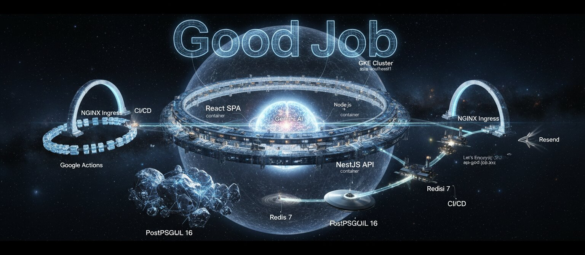

# 🏆 Good Job — Employee Recognition & Reward Platform

[](https://github.com/dongitran/Good-Job/actions/workflows/ci.yml)
[](https://github.com/dongitran/Good-Job/actions/workflows/deploy-apps.yml)
[](https://github.com/dongitran/Good-Job/actions/workflows/gitleaks.yml)



> Peer-to-peer recognition system where employees send kudos with points tied to core values, and redeem rewards.

🧪 Designed with **SDD** (Spec-Driven Development) and **TDD** (Test-Driven Development) from day one.

---

## ⚡ Quick Start

```bash
# Install dependencies (pnpm workspaces)
pnpm install

# Start all services (PostgreSQL, Redis, API, Web)
docker compose up -d --build

# Run E2E tests (170 tests, ~5 min)
cd apps/e2e && npx playwright test --project=chromium-desktop
```

---

## 🏗️ Architecture

```
good-job/
├── apps/
│   ├── api/          # 🔧 NestJS backend (REST API)
│   ├── web/          # 🎨 React frontend (SPA)
│   ├── e2e/          # 🧪 Playwright E2E tests (170 tests)
│   └── infra/        # ☁️  Pulumi IaC (AWS ECS)
├── plans/            # 📋 Specs & design docs (SDD)
├── designs/          # 🎯 UI/UX mockups
├── docker-compose.yml
└── .github/workflows/  # CI/CD (GitHub Actions)
```

### Tech Stack

| Layer | Stack |
|:------|:------|
| 🎨 Frontend | React 18, TypeScript, Vite, Tailwind CSS |
| 🔧 Backend | NestJS 11, TypeORM, PostgreSQL 16, Redis 7 |
| 📡 Real-time | SSE + Redis Pub/Sub |
|  Testing | Playwright (E2E), Jest (Unit/Integration) |
| 🚀 Deploy | Docker, GitHub Actions, AWS ECS (Pulumi) |

---

## 🧪 Development Methodology

### 📋 SDD — Spec-Driven Development

Every feature starts from a **written spec** before any code is written:

```
plans/00-product-overview.md    → Product vision & architecture
plans/01-*.md ~ 0N-*.md         → Feature specs & implementation plans
```

### 🔴🟢♻️ TDD — Test-Driven Development

```
1. ✍️  Write E2E test (expect failure)
2. 🔨 Implement feature
3. 🔄 Rebuild Docker → Re-run test (expect pass)
4. 🧹 Refactor with confidence
```

**170 E2E tests** across 16 spec files covering every user flow:

| Suite | Coverage |
|:------|:---------|
| `auth-email` `google-oauth` | 🔐 Signup, signin, email verify, password reset |
| `onboarding` `invite-signup` | 🚀 Org setup, invite flow |
| `dashboard` `give-kudos` | 💬 Recognition feed, kudos sending |
| `leaderboard` `profile` | 📊 Rankings, user profiles |
| `rewards-user` `redemptions-race` | 🎁 Reward redemption, concurrency |
| `admin-*` (4 specs) | 🛡️ Dashboard, users, rewards, redemptions |
| `landing` `settings` | 🏠 Public pages, user settings |

---

## 🔑 Key Features

- **💰 Dual-Balance Points** — Giveable (monthly budget) + Redeemable (earned wallet)
- **💬 Peer Recognition** — Send kudos with points tied to org-defined core values
- **🎁 Reward Catalog** — Admin-managed rewards with stock tracking & race-condition protection
- **📊 Admin Analytics** — Trends, leaderboards, engagement metrics, team management
- **🔐 Route-level Security** — AdminGuard + JWT auth + role-based access
- **📡 Real-time Feed** — SSE-powered live kudos stream
- **🏢 Multi-tenant** — Full org isolation from day one

---

## 🐳 Docker Commands

```bash
docker compose up -d --build        # Build & start all
docker compose up -d --build api    # Rebuild API only
docker compose up -d --build web    # Rebuild Web only
docker compose down                 # Stop all
docker compose logs -f api          # Tail API logs
```

## 🧪 Testing

```bash
# E2E (against Docker containers)
cd apps/e2e && npx playwright test --project=chromium-desktop

# Single spec
npx playwright test tests/give-kudos.spec.ts --project=chromium-desktop

# Unit tests
cd apps/api && npm run test
```

## 📦 Database

```bash
cd apps/api
npm run migration:generate --name=MigrationName
npm run migration:run
npm run migration:revert
npm run db:seed     # Demo data
```

---

## 📄 License

[MIT](LICENSE)
