# Phase 05 — Database Design

## Overview

**Status**: ✅ Ready for Implementation
**Goal**: Database schema hoàn chỉnh cho "Good Job" Recognition & Reward Platform

**Core Requirements:**
- Multi-tenant architecture (organization-scoped)
- Dual-balance point system (Giveable + Redeemable)
- **Immutable ledger pattern** cho audit trail đầy đủ
- **Optimistic locking** for concurrency control
- **Idempotency protection** cho redemptions
- **Transaction atomicity** for data integrity
- RBAC support (member/admin/owner)
- Soft delete với audit fields (except transactions)

---

## 1. Entity Relationship Diagram (ERD)

### 1.1 Visual ERD

```mermaid
erDiagram
    ORGANIZATIONS ||--o{ USERS : "has many"
    ORGANIZATIONS ||--o{ DEPARTMENTS : "defines"
    ORGANIZATIONS ||--o{ CORE_VALUES : "defines"
    ORGANIZATIONS ||--o{ RECOGNITIONS : "contains"
    ORGANIZATIONS ||--o{ REWARDS : "offers"
    ORGANIZATIONS ||--o{ MONTHLY_POINT_BUDGETS : "manages"
    ORGANIZATIONS ||--o{ INVITATIONS : "sends"

    DEPARTMENTS ||--o{ USERS : "has members"

    USERS ||--o{ OAUTH_CONNECTIONS : "linked accounts"
    USERS ||--o{ EMAIL_VERIFICATION_TOKENS : "verify email"
    USERS ||--o{ PASSWORD_RESET_TOKENS : "reset password"
    USERS ||--o{ RECOGNITIONS_AS_GIVER : "gives"
    USERS ||--o{ RECOGNITIONS_AS_RECEIVER : "receives"
    USERS ||--o{ POINT_TRANSACTIONS : "has transaction log"
    USERS ||--o{ POINT_BALANCES : "has current balance"
    USERS ||--o{ MONTHLY_POINT_BUDGETS : "has budget"
    USERS ||--o{ REDEMPTIONS : "redeems"
    USERS ||--o{ RECOGNITION_REACTIONS : "reacts"
    USERS ||--o{ RECOGNITION_COMMENTS : "comments"

    RECOGNITIONS ||--o{ RECOGNITION_REACTIONS : "has reactions"
    RECOGNITIONS ||--o{ RECOGNITION_COMMENTS : "has comments"
    RECOGNITIONS }o--|| CORE_VALUES : "tagged with"

    REWARDS ||--o{ REDEMPTIONS : "redeemed as"

    ORGANIZATIONS {
        uuid id PK
        varchar name "NOT NULL"
        varchar slug "NOT NULL, globally UNIQUE"
        enum industry "tech|gaming|agency|finance|other"
        enum company_size "1-10|11-50|51-200|201-500|500+"
        varchar logo_url "NULLABLE, uploaded logo"
        jsonb settings "points, budget, currency config"
        enum plan "free|pro_trial|pro"
        timestamptz trial_ends_at
        timestamptz created_at
        timestamptz updated_at
        uuid created_by
        uuid updated_by
        timestamptz deleted_at
        uuid deleted_by
    }

    DEPARTMENTS {
        uuid id PK
        uuid org_id FK "NOT NULL, indexed"
        varchar name "NOT NULL"
        timestamptz created_at
        timestamptz updated_at
        uuid created_by
        uuid updated_by
        timestamptz deleted_at
        uuid deleted_by
    }

    USERS {
        uuid id PK
        varchar email "NOT NULL, globally UNIQUE"
        varchar password_hash "NULLABLE for OAuth"
        timestamptz email_verified_at "NULLABLE, NULL = unverified"
        varchar full_name "NOT NULL"
        uuid org_id FK "NULLABLE during OAuth onboarding"
        uuid department_id FK "NULLABLE"
        enum role "member|admin|owner"
        varchar avatar_url
        boolean is_active "DEFAULT true"
        timestamptz created_at
        timestamptz updated_at
        uuid created_by
        uuid updated_by
        timestamptz deleted_at
        uuid deleted_by
    }

    OAUTH_CONNECTIONS {
        uuid id PK
        uuid user_id FK "NOT NULL, indexed"
        enum provider "google|microsoft"
        varchar provider_user_id "NOT NULL, UNIQUE per provider"
        text access_token "encrypted"
        text refresh_token "encrypted, NULLABLE"
        timestamptz token_expires_at
        timestamptz created_at
        timestamptz updated_at
    }

    EMAIL_VERIFICATION_TOKENS {
        uuid id PK
        uuid user_id FK "NOT NULL"
        varchar token "NOT NULL, indexed, random UUID"
        timestamptz expires_at "NOT NULL, 24h from creation"
        timestamptz created_at
    }

    PASSWORD_RESET_TOKENS {
        uuid id PK
        uuid user_id FK "NOT NULL"
        varchar token "NOT NULL, indexed, random UUID"
        timestamptz expires_at "NOT NULL, 1h from creation"
        timestamptz used_at "NULLABLE, NULL = unused"
        timestamptz created_at
    }

    INVITATIONS {
        uuid id PK
        uuid org_id FK "NOT NULL, indexed"
        varchar email "NOT NULL, lowercase"
        enum role "member|admin"
        uuid department_id FK "NULLABLE"
        uuid invited_by FK "NOT NULL, user_id"
        varchar token "NOT NULL, indexed, random UUID"
        timestamptz expires_at "NOT NULL, 7 days"
        timestamptz accepted_at "NULLABLE"
        timestamptz created_at
    }

    CORE_VALUES {
        uuid id PK
        uuid org_id FK "NOT NULL"
        varchar name "NOT NULL"
        varchar emoji
        varchar color
        boolean is_active "DEFAULT true"
        timestamptz created_at
        timestamptz updated_at
        uuid created_by
        uuid updated_by
        timestamptz deleted_at
        uuid deleted_by
    }

    RECOGNITIONS {
        uuid id PK
        uuid org_id FK "NOT NULL"
        uuid giver_id FK "NOT NULL, indexed"
        uuid receiver_id FK "NOT NULL, indexed"
        int points "NOT NULL, validated by org settings"
        text message "NOT NULL, min 10 chars"
        uuid value_id FK "NOT NULL"
        boolean is_private "DEFAULT false"
        timestamptz created_at "indexed"
        timestamptz updated_at
        uuid created_by
        uuid updated_by
        timestamptz deleted_at
        uuid deleted_by
    }

    RECOGNITION_REACTIONS {
        uuid id PK
        uuid recognition_id FK "NOT NULL"
        uuid user_id FK "NOT NULL"
        varchar emoji "max 10, UNIQUE with recognition+user"
        timestamptz created_at
    }

    RECOGNITION_COMMENTS {
        uuid id PK
        uuid recognition_id FK "NOT NULL"
        uuid user_id FK "NOT NULL"
        text content "NOT NULL"
        timestamptz created_at
    }

    POINT_TRANSACTIONS {
        uuid id PK
        uuid org_id FK "NOT NULL"
        uuid user_id FK "NOT NULL, indexed"
        enum type "give|receive|redeem|reset"
        int amount "can be negative"
        enum balance_type "giveable|redeemable"
        varchar reference_type
        uuid reference_id
        text description
        uuid created_by "immutable audit"
        timestamptz created_at "indexed, immutable"
    }

    POINT_BALANCES {
        uuid user_id PK "NOT NULL, FK to users"
        enum balance_type PK "giveable or redeemable"
        int current_balance "NOT NULL, materialized"
        uuid last_transaction_id "FK, sync checkpoint"
        int version "DEFAULT 0"
        timestamptz updated_at
    }

    MONTHLY_POINT_BUDGETS {
        uuid id PK
        uuid org_id FK "NOT NULL"
        uuid user_id FK "NOT NULL"
        date month "First day, UNIQUE per user"
        int total_budget "NOT NULL, non-negative"
        int spent "NOT NULL, within budget"
        int version "DEFAULT 0, optimistic lock"
        timestamptz created_at
        timestamptz updated_at
    }

    REWARDS {
        uuid id PK
        uuid org_id FK "NOT NULL"
        varchar name "NOT NULL"
        text description
        int points_cost "NOT NULL, positive"
        enum category "swag|gift_card|time_off|experience"
        varchar image_url
        int stock "DEFAULT -1"
        boolean is_active "DEFAULT true"
        timestamptz created_at
        timestamptz updated_at
        uuid created_by
        uuid updated_by
        timestamptz deleted_at
        uuid deleted_by
    }

    REDEMPTIONS {
        uuid id PK
        uuid org_id FK "NOT NULL"
        uuid reward_id FK "NOT NULL"
        uuid user_id FK "NOT NULL, indexed"
        int points_spent "NOT NULL"
        enum status "pending|approved|fulfilled|rejected"
        varchar idempotency_key "NOT NULL, globally UNIQUE"
        timestamptz created_at "indexed"
        timestamptz fulfilled_at
    }
```



### 1.2 Schema Summary

| Table | Rows Est. | Purpose | Critical Indexes |
|-------|-----------|---------|------------------|
| organizations | ~1K | Multi-tenant root | slug (UNIQUE) |
| departments | ~10K | Department management per org | org_id + name (UNIQUE) |
| users | ~100K | Auth + RBAC | email (UNIQUE), org_id, department_id |
| oauth_connections | ~150K | OAuth provider linking | user_id + provider (UNIQUE), provider_user_id (UNIQUE) |
| email_verification_tokens | ~50K | Email verification flow | user_id, token (UNIQUE) |
| password_reset_tokens | ~100K | Password reset flow | user_id, token (UNIQUE) |
| invitations | ~200K | Pending team invites | org_id + email (UNIQUE), token (UNIQUE) |
| core_values | ~100 | Recognition tags | org_id + is_active |
| recognitions | ~10M | Main domain entity | org_id + created_at, receiver_id, giver_id |
| recognition_reactions | ~50M | Social engagement | recognition_id + user_id + emoji (UNIQUE) |
| recognition_comments | ~5M | Discussions | recognition_id + created_at |
| point_transactions | ~50M | **Immutable audit trail** | user_id + balance_type, reference |
| point_balances | ~200K | **Current balance snapshot** | (user_id, balance_type) PK |
| monthly_point_budgets | ~100K | Monthly point allocation | user_id + month (UNIQUE) |
| rewards | ~1K | Catalog | org_id + is_active |
| redemptions | ~1M | **Idempotency** | idempotency_key (UNIQUE), user_id |

---

## 2. Data Dictionary

### Table: organizations

| Column | Type | Constraints | Description |
|--------|------|-------------|-------------|
| id | uuid | PK | Tenant identifier |
| name | varchar | NOT NULL | Display name |
| slug | varchar | NOT NULL, UNIQUE | URL-friendly ID |
| industry | enum | NULLABLE | tech \| gaming \| agency \| finance \| other |
| company_size | enum | NULLABLE | 1-10 \| 11-50 \| 51-200 \| 201-500 \| 500+ |
| logo_url | varchar | NULLABLE | Organization logo URL (uploaded during onboarding) |
| settings | jsonb | DEFAULT '{}' | **Admin-configurable:** points (min/max/currency/value), budget (monthly/resetDay) |
| plan | enum | DEFAULT 'pro_trial' | free \| pro_trial \| pro |
| trial_ends_at | timestamptz | NULLABLE | Trial expiry |
| created_at | timestamptz | NOT NULL | Creation timestamp |
| updated_at | timestamptz | NOT NULL | Last update |
| created_by | uuid | NULLABLE | Audit: who created |
| updated_by | uuid | NULLABLE | Audit: who updated |
| deleted_at | timestamptz | NULLABLE | Soft delete |
| deleted_by | uuid | NULLABLE | Audit: who deleted |

**Settings JSONB Structure:**
```typescript
interface OrganizationSettings {
  points?: {
    minPerKudo: number;          // Min points per recognition (e.g., 10)
    maxPerKudo: number;          // Max points per recognition (e.g., 50)
    valueInCurrency: number;     // Point monetary value (e.g., 1000 = 1 point = 1000 VND)
    currency: string;            // Currency code (e.g., "VND", "USD")
  };
  budget?: {
    monthlyGivingBudget: number; // Monthly points allocated per user (e.g., 200)
    resetDay: number;            // Day of month to reset budgets (1-31, default: 1)
  };
}
```

### Table: users

| Column | Type | Constraints | Description |
|--------|------|-------------|-------------|
| id | uuid | PK | User identifier |
| email | varchar | NOT NULL, UNIQUE | Login credential (lowercase, indexed) |
| password_hash | varchar | NULLABLE | Bcrypt hash (NULL for OAuth-only users) |
| email_verified_at | timestamptz | NULLABLE | Email verification timestamp (NULL = unverified) |
| full_name | varchar | NOT NULL | Display name |
| org_id | uuid | NULLABLE, FK, INDEXED | Tenant scope (NULL during OAuth onboarding, required before app access) |
| department_id | uuid | NULLABLE, FK | Department reference (replaces department varchar) |
| role | enum | DEFAULT 'member' | member \| admin \| owner |
| avatar_url | varchar | NULLABLE | Profile picture URL |
| is_active | boolean | DEFAULT true | Account status (for deactivating users) |
| created_at | timestamptz | NOT NULL | Registration timestamp |
| updated_at | timestamptz | NOT NULL | Last profile update |
| created_by | uuid | NULLABLE | Audit: who created |
| updated_by | uuid | NULLABLE | Audit: who updated |
| deleted_at | timestamptz | NULLABLE | Soft delete timestamp |
| deleted_by | uuid | NULLABLE | Audit: who deleted |

**Authentication Flow Notes:**

1. **Email/Password Signup:**
   - Create user with password_hash, email_verified_at = NULL
   - Send verification email
   - User clicks link → set email_verified_at = NOW()

2. **OAuth Signup (Google/Microsoft):**
   - Create user with password_hash = NULL, email_verified_at = NOW() (OAuth providers verify emails)
   - Create oauth_connections record
   - org_id = NULL initially (redirect to org selection/creation)
   - After org selected/created → update org_id

3. **Hybrid (OAuth + Password):**
   - User can have password_hash AND oauth_connections
   - Can login via either method

4. **Security Rules:**
   - Users with email_verified_at = NULL cannot perform critical actions
   - org_id MUST be set before accessing main app (enforced in application layer)
   - OAuth login only links to existing account if email is already verified

### Table: departments

| Column | Type | Constraints | Description |
|--------|------|-------------|-------------|
| id | uuid | PK | Department identifier |
| org_id | uuid | NOT NULL, FK, INDEXED | Tenant scope |
| name | varchar | NOT NULL | Department name (e.g., "Engineering", "Product", "Design") |
| created_at | timestamptz | NOT NULL | Creation timestamp |
| updated_at | timestamptz | NOT NULL | Last update |
| created_by | uuid | NULLABLE | Audit: who created |
| updated_by | uuid | NULLABLE | Audit: who updated |
| deleted_at | timestamptz | NULLABLE | Soft delete timestamp |
| deleted_by | uuid | NULLABLE | Audit: who deleted |

**Unique Constraint:** `(org_id, name)` - Department name must be unique within organization

**Business Rules:**
- Admins can create/edit/delete departments
- Users are assigned to departments via users.department_id
- Department deletion is soft delete (keeps historical data)
- Used for filtering in analytics and user management

### Table: oauth_connections

| Column | Type | Constraints | Description |
|--------|------|-------------|-------------|
| id | uuid | PK | OAuth connection identifier |
| user_id | uuid | NOT NULL, FK, INDEXED | User who owns this OAuth connection |
| provider | enum | NOT NULL | google \| microsoft |
| provider_user_id | varchar | NOT NULL | Unique user ID from OAuth provider (e.g., Google sub claim) |
| access_token | text | NOT NULL | Encrypted OAuth access token |
| refresh_token | text | NULLABLE | Encrypted OAuth refresh token (nullable for implicit flow) |
| token_expires_at | timestamptz | NOT NULL | When access_token expires |
| created_at | timestamptz | NOT NULL | When OAuth connection was created |
| updated_at | timestamptz | NOT NULL | Last token refresh |

**Composite Unique Constraint:** `(user_id, provider)` - One user can have one connection per provider
**Unique Constraint:** `provider_user_id` - One OAuth account = one user (prevents duplicate accounts)

**Security Notes:**
- Tokens stored encrypted at rest
- Access tokens refreshed automatically when expired using refresh_token
- Supports multiple providers per user (user can login via Google OR Microsoft)
- When OAuth connection is revoked, delete the oauth_connections record

**OAuth Flow:**
1. User authenticates with Google → receives tokens
2. Check if provider_user_id exists → existing connection
3. If not, check if user exists by email AND email_verified_at is NOT NULL
4. Link OAuth to existing verified user OR create new user
5. Store encrypted tokens in oauth_connections

### Table: email_verification_tokens

| Column | Type | Constraints | Description |
|--------|------|-------------|-------------|
| id | uuid | PK | Token identifier |
| user_id | uuid | NOT NULL, FK | User who needs to verify email |
| token | varchar | NOT NULL, INDEXED | Random UUID token (sent via email link) |
| expires_at | timestamptz | NOT NULL | Token expiry (24 hours from creation) |
| created_at | timestamptz | NOT NULL | When token was created |

**Unique Constraint:** `token` - Token must be globally unique

**Verification Flow:**
1. User signs up with email/password → users.email_verified_at = NULL
2. System generates random UUID token → insert into email_verification_tokens
3. Send email with link: `https://app.com/verify-email?token={token}`
4. User clicks link → backend validates token:
   - Check token exists and not expired
   - Update users.email_verified_at = NOW()
   - Delete used token
5. If expired → allow user to request new token (delete old, create new)

**Business Rules:**
- Tokens expire after 24 hours
- One active token per user (delete old when creating new)
- OAuth users skip this (email_verified_at set immediately)
- Unverified users have limited access (cannot give kudos, redeem rewards, etc.)

### Table: password_reset_tokens

| Column | Type | Constraints | Description |
|--------|------|-------------|-------------|
| id | uuid | PK | Token identifier |
| user_id | uuid | NOT NULL, FK | User who requested password reset |
| token | varchar | NOT NULL, INDEXED | Random UUID token (sent via email link) |
| expires_at | timestamptz | NOT NULL | Token expiry (1 hour from creation) |
| used_at | timestamptz | NULLABLE | When token was used (NULL = unused) |
| created_at | timestamptz | NOT NULL | When token was created |

**Unique Constraint:** `token` - Token must be globally unique

**Password Reset Flow:**
1. User clicks "Forgot Password" → enters email
2. System finds user by email → generates random UUID token
3. Insert into password_reset_tokens (expires_at = NOW() + 1 hour)
4. Send email with link: `https://app.com/reset-password?token={token}`
5. User clicks link → backend validates token:
   - Check token exists, not expired, and used_at IS NULL
   - Show password reset form
6. User submits new password:
   - Update users.password_hash
   - Set password_reset_tokens.used_at = NOW()
7. If expired → user must request new token

**Security Rules:**
- Tokens expire after 1 hour (short window for security)
- Tokens are single-use (used_at prevents reuse)
- Creating new token doesn't invalidate old ones (allows multiple requests)
- Rate limit password reset requests (max 3 per hour per email)

### Table: invitations

| Column | Type | Constraints | Description |
|--------|------|-------------|-------------|
| id | uuid | PK | Invitation identifier |
| org_id | uuid | NOT NULL, FK, INDEXED | Organization sending invitation |
| email | varchar | NOT NULL | Invitee email (lowercase, normalized) |
| role | enum | NOT NULL | member \| admin (invited user's role) |
| department_id | uuid | NULLABLE, FK | Assigned department (optional) |
| invited_by | uuid | NOT NULL, FK | User ID of inviter (for audit) |
| token | varchar | NOT NULL, INDEXED | Random UUID token (for accept link) |
| expires_at | timestamptz | NOT NULL | Invitation expiry (7 days from creation) |
| accepted_at | timestamptz | NULLABLE | When invitation was accepted (NULL = pending) |
| created_at | timestamptz | NOT NULL | When invitation was created |

**Composite Unique Constraint:** `(org_id, email)` - Cannot invite same email twice to same org
**Unique Constraint:** `token` - Token must be globally unique

**Invitation Flow:**
1. Admin enters emails to invite → system creates invitation records
2. Send email with link: `https://app.com/join?token={token}`
3. Invitee clicks link → backend validates token:
   - Check token exists, not expired, and accepted_at IS NULL
   - Check if user with email exists:
     - **If exists:** Link user to org (update users.org_id), set invitation.accepted_at = NOW()
     - **If not exists:** Redirect to signup with pre-filled email, after signup link to org
4. If expired → admin can resend (create new invitation, old one remains expired)

**Business Rules:**
- Invitations expire after 7 days
- Admin can "Resend" invitation → creates new invitation record (old one stays for audit)
- Invited users automatically join the specified organization
- Shows in Admin UI: "Pending Invites (8)" count
- Can bulk import via CSV (onboarding step 4)

### Table: core_values

| Column | Type | Constraints | Description |
|--------|------|-------------|-------------|
| id | uuid | PK | Value identifier |
| org_id | uuid | NOT NULL, FK | Tenant scope |
| name | varchar | NOT NULL | Value name (e.g., "Teamwork") |
| emoji | varchar | NULLABLE | Icon |
| color | varchar | NULLABLE | Hex color |
| is_active | boolean | DEFAULT true | Selectable flag |
| created_at | timestamptz | NOT NULL | Creation |
| updated_at | timestamptz | NOT NULL | Last update |
| created_by | uuid | NULLABLE | Audit |
| updated_by | uuid | NULLABLE | Audit |
| deleted_at | timestamptz | NULLABLE | Soft delete |
| deleted_by | uuid | NULLABLE | Audit |

### Table: recognitions

| Column | Type | Constraints | Description |
|--------|------|-------------|-------------|
| id | uuid | PK | Recognition identifier |
| org_id | uuid | NOT NULL, FK, INDEXED | Tenant scope |
| giver_id | uuid | NOT NULL, FK, INDEXED | Who gave |
| receiver_id | uuid | NOT NULL, FK, INDEXED | Who received |
| points | int | NOT NULL, CHECK (> 0) | **Range validated by org.settings** (default: 10-50) |
| message | text | NOT NULL, CHECK (len >= 10) | Recognition message |
| value_id | uuid | NOT NULL, FK | Tagged core value |
| is_private | boolean | DEFAULT false | Visibility |
| created_at | timestamptz | NOT NULL, INDEXED | Recognition timestamp |
| updated_at | timestamptz | NOT NULL | Last update |
| created_by | uuid | NULLABLE | Audit |
| updated_by | uuid | NULLABLE | Audit |
| deleted_at | timestamptz | NULLABLE | Soft delete |
| deleted_by | uuid | NULLABLE | Audit |

**Business Rules:**
- Self-recognition: `CHECK (giver_id != receiver_id)`
- Points range: **Admin-configurable** via `organizations.settings.minPoints` and `maxPoints` (default: 10-50)
- Message min length: 10 characters
- DB enforces `points > 0`, application validates against org settings

### Table: recognition_reactions

| Column | Type | Constraints | Description |
|--------|------|-------------|-------------|
| id | uuid | PK | Reaction identifier |
| recognition_id | uuid | NOT NULL, FK | Target recognition |
| user_id | uuid | NOT NULL, FK | Who reacted |
| emoji | varchar(10) | NOT NULL | Emoji (❤️, 👏, 🎉, 🚀) |
| created_at | timestamptz | NOT NULL | Reaction time |

**Unique Constraint:** `(recognition_id, user_id, emoji)` - One emoji per user per recognition

### Table: recognition_comments

| Column | Type | Constraints | Description |
|--------|------|-------------|-------------|
| id | uuid | PK | Comment identifier |
| recognition_id | uuid | NOT NULL, FK | Target recognition |
| user_id | uuid | NOT NULL, FK | Comment author |
| content | text | NOT NULL | Comment text |
| created_at | timestamptz | NOT NULL | Comment time |

### Table: point_transactions (Immutable Ledger Pattern)

| Column | Type | Constraints | Description |
|--------|------|-------------|-------------|
| id | uuid | PK | Transaction identifier |
| org_id | uuid | NOT NULL, FK | Tenant scope |
| user_id | uuid | NOT NULL, FK, INDEXED | Transaction owner |
| type | enum | NOT NULL | give \| receive \| redeem \| reset |
| amount | int | NOT NULL | Delta (can be negative) |
| balance_type | enum | NOT NULL, INDEXED | giveable \| redeemable |
| reference_type | varchar | NULLABLE | Entity type (recognition, redemption) |
| reference_id | uuid | NULLABLE, INDEXED | Entity ID |
| description | text | NULLABLE | Human-readable note |
| created_by | uuid | NOT NULL | Who created (immutable) |
| created_at | timestamptz | NOT NULL, INDEXED | Transaction time (immutable) |

**⚠️ CRITICAL: Immutability Rules (Payment-Grade)**
- ❌ **NO** `updated_at` column - transactions are immutable
- ❌ **NO** `deleted_at` column - never soft delete transactions
- ❌ **NO** UPDATE/DELETE permissions - only INSERT allowed
- ✅ To correct errors: Create **reversal transaction** with opposite amount
- ✅ Balance = `SUM(amount) WHERE user_id AND balance_type`

**Purpose:** Single source of truth cho ALL point movements. Complete audit trail.

**Example Entries:**
```
GIVE:    user_1, -50, giveable   (deduct from giving budget)
RECEIVE: user_2, +50, redeemable (add to earning wallet)
REDEEM:  user_2, -500, redeemable (spend for reward)
RESET:   user_1, +200, giveable   (monthly budget allocation)
```

**Reversal Example (Error Correction):**
```
-- Original (wrong amount):
INSERT: user_1, -100, giveable, ref_id=recognition_123

-- Reversal (cancel original):
INSERT: user_1, +100, giveable, ref_id=recognition_123, description="Reversal: wrong amount"

-- Correct transaction:
INSERT: user_1, -50, giveable, ref_id=recognition_123, description="Corrected amount"
```

### Table: point_balances (Materialized Balance)

| Column | Type | Constraints | Description |
|--------|------|-------------|-------------|
| user_id | uuid | PK, FK | User identifier |
| balance_type | enum | PK | giveable \| redeemable (composite PK) |
| current_balance | int | NOT NULL, DEFAULT 0 | Denormalized balance for fast queries |
| last_transaction_id | uuid | NULLABLE, FK | Last processed transaction ID |
| version | int | NOT NULL, DEFAULT 0 | Optimistic locking counter |
| updated_at | timestamptz | NOT NULL | Last balance update |

**Primary Key:** `(user_id, balance_type)` - Each user has 2 rows

**Purpose:** Payment-grade balance management
- Fast O(1) balance lookups (vs O(n) SUM on transactions)
- Efficient row-level locking
- point_transactions is source of truth, this is materialized cache

**Business Rules:**
- Updated atomically with point_transactions inserts
- Daily reconciliation: Verify matches SUM(point_transactions)
- On drift: Rebuild from point_transactions (trust the ledger)

### Table: monthly_point_budgets

| Column | Type | Constraints | Description |
|--------|------|-------------|-------------|
| id | uuid | PK | Budget identifier |
| org_id | uuid | NOT NULL, FK | Tenant scope |
| user_id | uuid | NOT NULL, FK | Budget owner |
| month | date | NOT NULL | First day of month (2026-02-01) |
| total_budget | int | NOT NULL, CHECK (>= 0) | Monthly point allocation |
| spent | int | NOT NULL, DEFAULT 0, CHECK (0 <= spent <= total_budget) | Points given away |
| version | int | NOT NULL, DEFAULT 0 | **Optimistic locking** - increments on each update |
| created_at | timestamptz | NOT NULL | Budget creation |
| updated_at | timestamptz | NOT NULL | Last modification |

**Unique Constraint:** `(user_id, month)` - One record per user per month

**Business Rules:**
- Budget resets monthly (CRON job creates new record)
- Unused budget expires (use-it-or-lose-it)
- **Concurrency control:** Use `version` field for optimistic locking

### Table: rewards

| Column | Type | Constraints | Description |
|--------|------|-------------|-------------|
| id | uuid | PK | Reward identifier |
| org_id | uuid | NOT NULL, FK | Tenant scope |
| name | varchar | NOT NULL | Reward name |
| description | text | NULLABLE | Details |
| points_cost | int | NOT NULL, CHECK (> 0) | Redemption cost |
| category | enum | DEFAULT 'swag' | swag \| gift_card \| time_off \| experience |
| image_url | varchar | NULLABLE | Product image |
| stock | int | DEFAULT -1, CHECK (>= -1) | Quantity (-1 = unlimited) |
| is_active | boolean | DEFAULT true | Available flag |
| created_at | timestamptz | NOT NULL | Creation |
| updated_at | timestamptz | NOT NULL | Last update |
| created_by | uuid | NULLABLE | Audit |
| updated_by | uuid | NULLABLE | Audit |
| deleted_at | timestamptz | NULLABLE | Soft delete |
| deleted_by | uuid | NULLABLE | Audit |

### Table: redemptions (Idempotency Pattern)

| Column | Type | Constraints | Description |
|--------|------|-------------|-------------|
| id | uuid | PK | Redemption identifier |
| org_id | uuid | NOT NULL, FK | Tenant scope |
| reward_id | uuid | NOT NULL, FK | Redeemed reward |
| user_id | uuid | NOT NULL, FK, INDEXED | Redeemer |
| points_spent | int | NOT NULL | Point amount |
| status | enum | DEFAULT 'pending' | pending \| approved \| fulfilled \| rejected |
| idempotency_key | varchar | NOT NULL, UNIQUE | **Double-spend prevention** |
| created_at | timestamptz | NOT NULL, INDEXED | Redemption time |
| fulfilled_at | timestamptz | NULLABLE | Completion time |

**Idempotency Flow:**
1. Client generates UUID on button click
2. Rapid double-clicks send same `idempotency_key`
3. DB UNIQUE constraint prevents duplicates
4. Second request returns existing redemption

