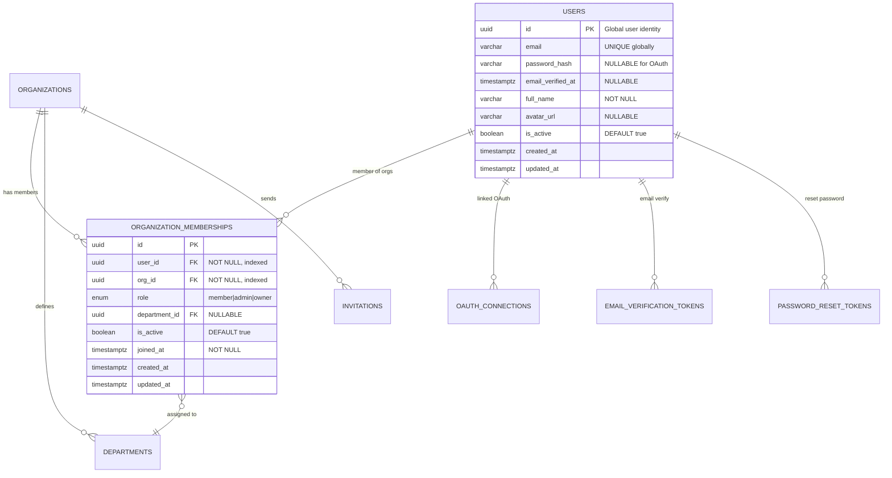
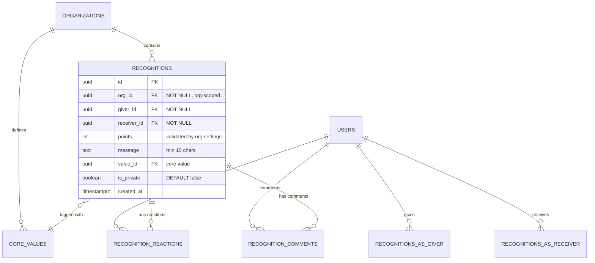
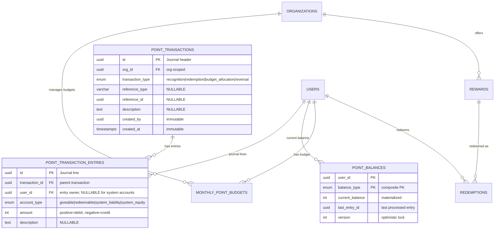

# Phase 05 — Database Design

## Overview

**Status**: ✅ Ready for Implementation
**Goal**: Database schema hoàn chỉnh cho "Good Job" Recognition & Reward Platform

**Core Requirements:**
- Multi-tenant architecture (organization-scoped)
- Dual-balance point system (Giveable + Redeemable)
- **Immutable ledger pattern** cho audit trail đầy đủ
- **Optimistic locking** for concurrency control
- **Idempotency protection** cho redemptions
- **Transaction atomicity** for data integrity
- RBAC support (member/admin/owner)
- Soft delete với audit fields (except transactions)

---

## 1. Entity Relationship Diagrams (ERD)

**Architecture:** Multi-org membership model - one user can belong to multiple organizations

---

### 1.1 ERD Part 1: User Management & Authentication

**Focus:** Identity, authentication, organization membership (Many-to-Many)



---

### 1.2 ERD Part 2: Recognition & Social Engagement

**Focus:** Recognition flow, reactions, comments, core values



---

### 1.3 ERD Part 3: Points Economy & Rewards (Double-Entry Bookkeeping)

**Focus:** Point transactions (double-entry ledger), balances, budgets, rewards

**Architecture:** True double-entry bookkeeping - every transaction has balanced journal entries



---

### 1.4 Schema Summary

| Table | Rows Est. | Purpose | Critical Indexes |
|-------|-----------|---------|------------------|
| organizations | ~1K | Multi-tenant root | slug (UNIQUE) |
| organization_memberships | ~200K | **Many-to-many**: User↔Org | (user_id, org_id) UNIQUE, user_id, org_id |
| departments | ~10K | Department management per org | org_id + name (UNIQUE) |
| users | ~100K | **Global identity** (multi-org) | email (UNIQUE globally) |
| oauth_connections | ~150K | OAuth provider linking | user_id + provider (UNIQUE), provider_user_id (UNIQUE) |
| email_verification_tokens | ~50K | Email verification flow | user_id, token (UNIQUE) |
| password_reset_tokens | ~100K | Password reset flow | user_id, token (UNIQUE) |
| invitations | ~200K | Pending team invites | org_id + email (UNIQUE), token (UNIQUE) |
| core_values | ~100 | Recognition tags | org_id + is_active |
| recognitions | ~10M | Main domain entity | org_id + created_at, receiver_id, giver_id |
| recognition_reactions | ~50M | Social engagement | recognition_id + user_id + emoji (UNIQUE) |
| recognition_comments | ~5M | Discussions | recognition_id + created_at |
| point_transactions | ~25M | **Double-entry journal header** | org_id, reference_type + reference_id |
| point_transaction_entries | ~50M | **Double-entry journal lines** | transaction_id, user_id + account_type |
| point_balances | ~200K | **Materialized balance cache** | (user_id, balance_type) PK |
| monthly_point_budgets | ~100K | Monthly point allocation | user_id + month (UNIQUE) |
| rewards | ~1K | Catalog | org_id + is_active |
| redemptions | ~1M | **Idempotency** | idempotency_key (UNIQUE), user_id |

---

## 2. Data Dictionary

### Table: organizations

| Column | Type | Constraints | Description |
|--------|------|-------------|-------------|
| id | uuid | PK | Tenant identifier |
| name | varchar | NOT NULL | Display name |
| slug | varchar | NOT NULL, UNIQUE | URL-friendly ID |
| industry | enum | NULLABLE | tech \| gaming \| agency \| finance \| other |
| company_size | enum | NULLABLE | 1-10 \| 11-50 \| 51-200 \| 201-500 \| 500+ |
| logo_url | varchar | NULLABLE | Organization logo URL (uploaded during onboarding) |
| settings | jsonb | DEFAULT '{}' | **Admin-configurable:** points (min/max/currency/value), budget (monthly/resetDay) |
| plan | enum | DEFAULT 'pro_trial' | free \| pro_trial \| pro |
| trial_ends_at | timestamptz | NULLABLE | Trial expiry |
| onboarding_completed_at | timestamptz | NULLABLE | NULL = onboarding pending, timestamp = completed. Gates redirect to /onboarding wizard. |
| created_at | timestamptz | NOT NULL | Creation timestamp |
| updated_at | timestamptz | NOT NULL | Last update |
| created_by | uuid | NULLABLE | Audit: who created |
| updated_by | uuid | NULLABLE | Audit: who updated |
| deleted_at | timestamptz | NULLABLE | Soft delete |
| deleted_by | uuid | NULLABLE | Audit: who deleted |

**Settings JSONB Structure:**
```typescript
interface OrganizationSettings {
  points?: {
    minPerKudo: number;          // Min points per recognition (e.g., 10)
    maxPerKudo: number;          // Max points per recognition (e.g., 50)
    valueInCurrency: number;     // Point monetary value (e.g., 1000 = 1 point = 1000 VND)
    currency: string;            // Currency code (e.g., "VND", "USD")
  };
  budget?: {
    monthlyGivingBudget: number; // Monthly points allocated per user (e.g., 200)
    resetDay: number;            // Day of month to reset budgets (1-31, default: 1)
  };
  rewardsBudget?: {
    monthlyLimit: number;        // Monthly $$ budget for reward fulfillment cost (0 = unlimited)
    currency: string;            // Currency code for monetary tracking (e.g., "VND", "USD")
    alertThresholdPercent: number; // Alert admin when X% of budget used (default: 80)
  };
}
```

### Table: users

| Column | Type | Constraints | Description |
|--------|------|-------------|-------------|
| id | uuid | PK | **Global user identifier** (NOT org-scoped) |
| email | varchar | NOT NULL, UNIQUE | **Globally unique** email (one user, many orgs) |
| password_hash | varchar | NULLABLE | Bcrypt hash (NULL for OAuth-only users) |
| email_verified_at | timestamptz | NULLABLE | Email verification timestamp (NULL = unverified) |
| full_name | varchar | NOT NULL | Display name |
| avatar_url | varchar | NULLABLE | Profile picture URL |
| is_active | boolean | DEFAULT true | Global account status (deactivate all org access) |
| created_at | timestamptz | NOT NULL | Registration timestamp |
| updated_at | timestamptz | NOT NULL | Last profile update |
| created_by | uuid | NULLABLE | Audit: who created |
| updated_by | uuid | NULLABLE | Audit: who updated |
| deleted_at | timestamptz | NULLABLE | Soft delete timestamp |
| deleted_by | uuid | NULLABLE | Audit: who deleted |

**⚠️ CRITICAL ARCHITECTURAL CHANGE: Multi-Org Membership Model**

**Before (OLD - Single Org):**
- users.org_id → One user belongs to ONE organization
- users.role → Role is fixed per user

**After (NEW - Multi-Org):**
- Users table has NO org_id, NO role, NO department_id
- organization_memberships table creates many-to-many relationship
- Same user can be in multiple orgs with different roles/departments

**Authentication & Authorization Flow:**

1. **Email/Password Signup:**
   - Create user (global identity)
   - email_verified_at = NULL
   - Auto-create personal org (`{fullName}'s Workspace`) with owner role
   - Send verification email
   - User clicks link → email_verified_at = NOW()
   - Redirect to `/onboarding` (onboarding_completed_at is NULL)

2. **OAuth Signup (Google/Microsoft):**
   - Create user (global identity)
   - email_verified_at = NOW() (OAuth provider verified)
   - Create oauth_connections record
   - Auto-create personal org with owner role
   - Redirect to `/onboarding` (onboarding_completed_at is NULL)

3. **Onboarding Flow (5-step wizard at /onboarding):**
   - **Step 1 — Welcome:** Static intro page
   - **Step 2 — Organization:** Update org name, industry, company size, logo → `PATCH /organizations/:id`
   - **Step 3 — Core Values:** Select/add at least 3 core values → `POST /organizations/:id/core-values`
   - **Step 4 — Invite Team:** Add teammate emails (manual or CSV) → `POST /organizations/:id/invitations`
   - **Step 5 — All Set:** Choose Demo or Fresh mode → `POST /organizations/:id/complete-onboarding`
   - On completion: `onboarding_completed_at = NOW()`, redirect to dashboard
   - **Gate:** If `onboarding_completed_at IS NULL`, authenticated users are redirected to `/onboarding`

4. **Create First Organization:**
   - Auto-created during signup → user becomes owner
   - Create organization_memberships record: { user_id, org_id, role: 'owner' }

4. **Join Existing Organization (via Invitation):**
   - User accepts invitation
   - Create organization_memberships record with invited role

5. **Multi-Org Login:**
   - User logs in → system queries: `SELECT * FROM organization_memberships WHERE user_id = ?`
   - If 0 memberships → "Create or Join Org" screen
   - If 1 membership → Auto-select, generate JWT
   - If 2+ memberships → Show org selector, user picks, generate JWT with org context

6. **Authorization (Role Checks):**
   - Query current membership: `SELECT role FROM organization_memberships WHERE user_id = ? AND org_id = ?`
   - Role is org-specific (admin in Org A, member in Org B)

**Security Rules:**
- email_verified_at = NULL → Limited access (cannot create recognitions)
- User MUST have at least 1 active membership to access app
- Each request includes orgId in JWT → validates membership exists

### Table: departments

| Column | Type | Constraints | Description |
|--------|------|-------------|-------------|
| id | uuid | PK | Department identifier |
| org_id | uuid | NOT NULL, FK, INDEXED | Tenant scope |
| name | varchar | NOT NULL | Department name (e.g., "Engineering", "Product", "Design") |
| created_at | timestamptz | NOT NULL | Creation timestamp |
| updated_at | timestamptz | NOT NULL | Last update |
| created_by | uuid | NULLABLE | Audit: who created |
| updated_by | uuid | NULLABLE | Audit: who updated |
| deleted_at | timestamptz | NULLABLE | Soft delete timestamp |
| deleted_by | uuid | NULLABLE | Audit: who deleted |

**Unique Constraint:** `(org_id, name)` - Department name must be unique within organization

**Business Rules:**
- Admins can create/edit/delete departments
- Users are assigned to departments via organization_memberships.department_id
- Department deletion is soft delete (keeps historical data)
- Used for filtering in analytics and user management

### Table: organization_memberships

| Column | Type | Constraints | Description |
|--------|------|-------------|-------------|
| id | uuid | PK | Membership identifier |
| user_id | uuid | NOT NULL, FK, INDEXED | Global user ID (references users.id) |
| org_id | uuid | NOT NULL, FK, INDEXED | Organization ID (references organizations.id) |
| role | enum | NOT NULL | member \| admin \| owner (role within THIS organization) |
| department_id | uuid | NULLABLE, FK | Department assignment (references departments.id) |
| is_active | boolean | DEFAULT true | Membership status (deactivate without deleting) |
| joined_at | timestamptz | NOT NULL | When user joined this organization |
| created_at | timestamptz | NOT NULL | Record creation timestamp |
| updated_at | timestamptz | NOT NULL | Last update timestamp |
| created_by | uuid | NULLABLE | Audit: who created this membership |
| updated_by | uuid | NULLABLE | Audit: who last updated |
| deleted_at | timestamptz | NULLABLE | Soft delete timestamp |
| deleted_by | uuid | NULLABLE | Audit: who deleted |

**Composite Unique Constraint:** `(user_id, org_id)` - One user can have ONE membership per organization

**Business Rules:**
- **Many-to-Many Relationship**: One user can be member of multiple organizations
- **Role is org-specific**: Same user can be "admin" in Org A and "member" in Org B
- **Department is org-specific**: User's department assignment varies per organization
- **Soft delete**: Deactivating membership preserves historical data (recognitions, transactions)
- **Owner role**: Each org should have at least 1 owner (enforced in application layer)

**Multi-Org Support Examples:**
```
User: john@example.com (ONE user record)

Memberships:
- Org A (Amanotes):     role=admin,  department=Engineering
- Org B (Client Corp):  role=member, department=Product
- Org C (Freelance):    role=owner,  department=NULL
```

**Authentication Flow:**
1. User logs in → System fetches all memberships: `SELECT * FROM organization_memberships WHERE user_id = ?`
2. If 0 memberships → Redirect to "Create or Join Organization"
3. If 1 membership → Auto-select, generate JWT with that org context
4. If 2+ memberships → Show org selector UI, user picks, generate JWT

**JWT Payload Structure:**
```typescript
{
  sub: userId,              // Global user ID
  email: "john@example.com",
  orgId: "org_123",        // Currently selected organization
  role: "admin",           // Role in current org (from membership)
  departmentId: "dept_1"   // Department in current org
}
```

**Invitation Flow:**
```
1. Admin invites: email@example.com to join Org A
2. User accepts invitation:
   - If user exists: Create organization_membership record
   - If new user: Create user + create organization_membership
3. Invitation.accepted_at = NOW()
```

### Table: oauth_connections

| Column | Type | Constraints | Description |
|--------|------|-------------|-------------|
| id | uuid | PK | OAuth connection identifier |
| user_id | uuid | NOT NULL, FK, INDEXED | User who owns this OAuth connection |
| provider | enum | NOT NULL | google \| microsoft |
| provider_user_id | varchar | NOT NULL | Unique user ID from OAuth provider (e.g., Google sub claim) |
| access_token | text | NOT NULL | Encrypted OAuth access token |
| refresh_token | text | NULLABLE | Encrypted OAuth refresh token (nullable for implicit flow) |
| token_expires_at | timestamptz | NOT NULL | When access_token expires |
| created_at | timestamptz | NOT NULL | When OAuth connection was created |
| updated_at | timestamptz | NOT NULL | Last token refresh |

**Composite Unique Constraint:** `(user_id, provider)` - One user can have one connection per provider
**Unique Constraint:** `provider_user_id` - One OAuth account = one user (prevents duplicate accounts)

**Security Notes:**
- Tokens stored encrypted at rest
- Access tokens refreshed automatically when expired using refresh_token
- Supports multiple providers per user (user can login via Google OR Microsoft)
- When OAuth connection is revoked, delete the oauth_connections record

**OAuth Flow:**
1. User authenticates with Google → receives tokens
2. Check if provider_user_id exists → existing connection
3. If not, check if user exists by email AND email_verified_at is NOT NULL
4. Link OAuth to existing verified user OR create new user
5. Store encrypted tokens in oauth_connections

### Table: email_verification_tokens

| Column | Type | Constraints | Description |
|--------|------|-------------|-------------|
| id | uuid | PK | Token identifier |
| user_id | uuid | NOT NULL, FK | User who needs to verify email |
| token | varchar | NOT NULL, INDEXED | Random UUID token (sent via email link) |
| expires_at | timestamptz | NOT NULL | Token expiry (24 hours from creation) |
| created_at | timestamptz | NOT NULL | When token was created |

**Unique Constraint:** `token` - Token must be globally unique

**Verification Flow:**
1. User signs up with email/password → users.email_verified_at = NULL
2. System generates random UUID token → insert into email_verification_tokens
3. Send email with link: `https://app.com/verify-email?token={token}`
4. User clicks link → backend validates token:
   - Check token exists and not expired
   - Update users.email_verified_at = NOW()
   - Delete used token
5. If expired → allow user to request new token (delete old, create new)

**Business Rules:**
- Tokens expire after 24 hours
- One active token per user (delete old when creating new)
- OAuth users skip this (email_verified_at set immediately)
- Unverified users have limited access (cannot give kudos, redeem rewards, etc.)

### Table: password_reset_tokens

| Column | Type | Constraints | Description |
|--------|------|-------------|-------------|
| id | uuid | PK | Token identifier |
| user_id | uuid | NOT NULL, FK | User who requested password reset |
| token | varchar | NOT NULL, INDEXED | Random UUID token (sent via email link) |
| expires_at | timestamptz | NOT NULL | Token expiry (1 hour from creation) |
| used_at | timestamptz | NULLABLE | When token was used (NULL = unused) |
| created_at | timestamptz | NOT NULL | When token was created |

**Unique Constraint:** `token` - Token must be globally unique

**Password Reset Flow:**
1. User clicks "Forgot Password" → enters email
2. System finds user by email → generates random UUID token
3. Insert into password_reset_tokens (expires_at = NOW() + 1 hour)
4. Send email with link: `https://app.com/reset-password?token={token}`
5. User clicks link → backend validates token:
   - Check token exists, not expired, and used_at IS NULL
   - Show password reset form
6. User submits new password:
   - Update users.password_hash
   - Set password_reset_tokens.used_at = NOW()
7. If expired → user must request new token

**Security Rules:**
- Tokens expire after 1 hour (short window for security)
- Tokens are single-use (used_at prevents reuse)
- Creating new token doesn't invalidate old ones (allows multiple requests)
- Rate limit password reset requests (max 3 per hour per email)

### Table: invitations

| Column | Type | Constraints | Description |
|--------|------|-------------|-------------|
| id | uuid | PK | Invitation identifier |
| org_id | uuid | NOT NULL, FK, INDEXED | Organization sending invitation |
| email | varchar | NOT NULL | Invitee email (lowercase, normalized) |
| role | enum | NOT NULL | member \| admin (invited user's role) |
| department_id | uuid | NULLABLE, FK | Assigned department (optional) |
| invited_by | uuid | NOT NULL, FK | User ID of inviter (for audit) |
| token | varchar | NOT NULL, INDEXED | Random UUID token (for accept link) |
| expires_at | timestamptz | NOT NULL | Invitation expiry (7 days from creation) |
| accepted_at | timestamptz | NULLABLE | When invitation was accepted (NULL = pending) |
| created_at | timestamptz | NOT NULL | When invitation was created |

**Composite Unique Constraint:** `(org_id, email)` - Cannot invite same email twice to same org
**Unique Constraint:** `token` - Token must be globally unique

**Invitation Flow:**
1. Admin enters emails to invite → system creates invitation records
2. Send email with link: `https://app.com/join?token={token}`
3. Invitee clicks link → backend validates token:
   - Check token exists, not expired, and accepted_at IS NULL
   - Check if user with email exists:
     - **If exists:** Link user to org (update users.org_id), set invitation.accepted_at = NOW()
     - **If not exists:** Redirect to signup with pre-filled email, after signup link to org
4. If expired → admin can resend (create new invitation, old one remains expired)

**Business Rules:**
- Invitations expire after 7 days
- Admin can "Resend" invitation → creates new invitation record (old one stays for audit)
- Invited users automatically join the specified organization
- Shows in Admin UI: "Pending Invites (8)" count
- Can bulk import via CSV (onboarding step 4)

### Table: core_values

| Column | Type | Constraints | Description |
|--------|------|-------------|-------------|
| id | uuid | PK | Value identifier |
| org_id | uuid | NOT NULL, FK | Tenant scope |
| name | varchar | NOT NULL | Value name (e.g., "Teamwork") |
| emoji | varchar | NULLABLE | Icon |
| color | varchar | NULLABLE | Hex color |
| is_active | boolean | DEFAULT true | Selectable flag |
| created_at | timestamptz | NOT NULL | Creation |
| updated_at | timestamptz | NOT NULL | Last update |
| created_by | uuid | NULLABLE | Audit |
| updated_by | uuid | NULLABLE | Audit |
| deleted_at | timestamptz | NULLABLE | Soft delete |
| deleted_by | uuid | NULLABLE | Audit |

### Table: recognitions

| Column | Type | Constraints | Description |
|--------|------|-------------|-------------|
| id | uuid | PK | Recognition identifier |
| org_id | uuid | NOT NULL, FK, INDEXED | Tenant scope |
| giver_id | uuid | NOT NULL, FK, INDEXED | Who gave |
| receiver_id | uuid | NOT NULL, FK, INDEXED | Who received |
| points | int | NOT NULL, CHECK (> 0) | **Range validated by org.settings** (default: 10-50) |
| message | text | NOT NULL, CHECK (len >= 10) | Recognition message |
| value_id | uuid | NOT NULL, FK | Tagged core value |
| is_private | boolean | DEFAULT false | Visibility |
| created_at | timestamptz | NOT NULL, INDEXED | Recognition timestamp |
| updated_at | timestamptz | NOT NULL | Last update |
| created_by | uuid | NULLABLE | Audit |
| updated_by | uuid | NULLABLE | Audit |
| deleted_at | timestamptz | NULLABLE | Soft delete |
| deleted_by | uuid | NULLABLE | Audit |

**Business Rules:**
- Self-recognition: `CHECK (giver_id != receiver_id)`
- Points range: **Admin-configurable** via `organizations.settings.minPoints` and `maxPoints` (default: 10-50)
- Message min length: 10 characters
- DB enforces `points > 0`, application validates against org settings

### Table: recognition_reactions

| Column | Type | Constraints | Description |
|--------|------|-------------|-------------|
| id | uuid | PK | Reaction identifier |
| recognition_id | uuid | NOT NULL, FK | Target recognition |
| user_id | uuid | NOT NULL, FK | Who reacted |
| emoji | varchar(10) | NOT NULL | Emoji (❤️, 👏, 🎉, 🚀) |
| created_at | timestamptz | NOT NULL | Reaction time |

**Unique Constraint:** `(recognition_id, user_id, emoji)` - One emoji per user per recognition

### Table: recognition_comments

| Column | Type | Constraints | Description |
|--------|------|-------------|-------------|
| id | uuid | PK | Comment identifier |
| recognition_id | uuid | NOT NULL, FK | Target recognition |
| user_id | uuid | NOT NULL, FK | Comment author |
| content | text | NOT NULL | Comment text |
| created_at | timestamptz | NOT NULL | Comment time |

### Table: point_transactions (Double-Entry Journal Header)

| Column | Type | Constraints | Description |
|--------|------|-------------|-------------|
| id | uuid | PK | Transaction identifier (journal header) |
| org_id | uuid | NOT NULL, FK | Tenant scope |
| transaction_type | enum | NOT NULL | recognition \| redemption \| budget_allocation \| reversal |
| reference_type | varchar | NULLABLE | Source entity type (recognition, redemption, budget) |
| reference_id | uuid | NULLABLE, INDEXED | Source entity ID |
| description | text | NULLABLE | Human-readable note |
| created_by | uuid | NOT NULL | Who created (immutable) |
| created_at | timestamptz | NOT NULL, INDEXED | Transaction time (immutable) |

**⚠️ CRITICAL: Immutability Rules (Payment-Grade)**
- ❌ **NO** `updated_at` column - transactions are immutable
- ❌ **NO** `deleted_at` column - never soft delete transactions
- ❌ **NO** UPDATE/DELETE permissions - only INSERT allowed
- ✅ To correct errors: Create **reversal transaction** (transaction_type='reversal')

**Purpose:** Journal header for double-entry bookkeeping. Each transaction links to 2+ balanced entries.

**Transaction Types:**
- `recognition`: User A gives points to User B (2 entries: debit giver, credit receiver)
- `redemption`: User redeems points for reward (2 entries: debit user, credit system)
- `budget_allocation`: Monthly budget reset (2 entries: debit user, credit system equity)
- `reversal`: Error correction (creates offsetting entries)

### Table: point_transaction_entries (Double-Entry Journal Lines)

| Column | Type | Constraints | Description |
|--------|------|-------------|-------------|
| id | uuid | PK | Entry identifier (journal line) |
| transaction_id | uuid | NOT NULL, FK, INDEXED | Parent transaction (journal header) |
| user_id | uuid | NULLABLE, FK, INDEXED | Entry owner (NULL for system accounts) |
| account_type | enum | NOT NULL | giveable \| redeemable \| system_liability \| system_equity |
| amount | int | NOT NULL | Positive = debit, Negative = credit |
| description | text | NULLABLE | Entry-specific note |

**⚠️ CRITICAL: Double-Entry Constraint (Zero-Sum Rule)**
```sql
-- All entries for a transaction MUST sum to zero
CONSTRAINT check_transaction_balanced
  CHECK (
    (SELECT SUM(amount) FROM point_transaction_entries
     WHERE transaction_id = point_transactions.id) = 0
  )
```

**Indexes:**
- `idx_entries_transaction` on `(transaction_id)` - for joining with transactions
- `idx_entries_user_account` on `(user_id, account_type)` - for balance calculation

**⚠️ CRITICAL: Immutability Rules**
- ❌ **NO** `updated_at` column - entries are immutable
- ❌ **NO** `deleted_at` column - never delete entries
- ❌ **NO** UPDATE/DELETE permissions - only INSERT allowed

**Account Types:**
- `giveable`: User's monthly giving budget (points they can give away)
- `redeemable`: User's earned points (points they can redeem for rewards)
- `system_liability`: System owes users (when users redeem points)
- `system_equity`: System-owned points (budget allocations)

**Purpose:** Double-entry bookkeeping lines. Source of truth for ALL point movements.

**Example 1: Recognition (A gives 50 points to B)**
```sql
-- Transaction Header
point_transactions: id='tx_1', type='recognition', ref_id='rec_123'

-- Double-Entry Lines (MUST sum to 0)
point_transaction_entries:
  [tx_1, user_A, giveable,   amount=-50]  -- Debit (decrease A's budget)
  [tx_1, user_B, redeemable, amount=+50]  -- Credit (increase B's wallet)

Verification: -50 + 50 = 0 ✓
```

**Example 2: Redemption (B spends 500 points)**
```sql
point_transactions: id='tx_2', type='redemption', ref_id='redeem_456'

point_transaction_entries:
  [tx_2, user_B, redeemable,       amount=-500]  -- Debit (decrease wallet)
  [tx_2, NULL,   system_liability, amount=+500]  -- Credit (system owes)

Verification: -500 + 500 = 0 ✓
```

**Example 3: Budget Allocation (A gets 200 monthly points)**
```sql
point_transactions: id='tx_3', type='budget_allocation', ref_id='budget_202602'

point_transaction_entries:
  [tx_3, user_A, giveable,      amount=+200]  -- Debit (increase budget)
  [tx_3, NULL,   system_equity, amount=-200]  -- Credit (system allocates)

Verification: +200 + (-200) = 0 ✓
```

**Example 4: Reversal (Fix recognition amount error)**
```sql
-- Step 1: Reversal transaction
point_transactions: id='tx_4', type='reversal', ref_id='rec_123'

point_transaction_entries:
  [tx_4, user_A, giveable,   amount=+100]  -- Reverse debit
  [tx_4, user_B, redeemable, amount=-100]  -- Reverse credit

-- Step 2: Correct transaction
point_transactions: id='tx_5', type='recognition', ref_id='rec_123'

point_transaction_entries:
  [tx_5, user_A, giveable,   amount=-50]
  [tx_5, user_B, redeemable, amount=+50]
```

**Balance Calculation:**
```sql
-- User A's giveable balance
SELECT SUM(amount) as balance
FROM point_transaction_entries
WHERE user_id = 'user_A' AND account_type = 'giveable';
```

**Audit Trail Benefits:**
1. ✅ **Atomic Transactions**: All entries succeed or all fail
2. ✅ **Zero-Sum Guarantee**: `SUM(amount) = 0` enforced by constraint
3. ✅ **Complete History**: Never update/delete, only append
4. ✅ **Easy Reconciliation**: System balance = User balance
5. ✅ **Fraud Detection**: Any imbalance = data corruption
6. ✅ **Regulatory Compliance**: GAAP/IFRS accounting standards

### Table: point_balances (Materialized Balance Cache)

| Column | Type | Constraints | Description |
|--------|------|-------------|-------------|
| user_id | uuid | PK, FK | User identifier |
| balance_type | enum | PK | giveable \| redeemable (composite PK) |
| current_balance | int | NOT NULL, DEFAULT 0 | Denormalized balance for fast queries |
| last_entry_id | uuid | NULLABLE, FK | Last processed entry ID (references point_transaction_entries) |
| version | int | NOT NULL, DEFAULT 0 | Optimistic locking counter |
| updated_at | timestamptz | NOT NULL | Last balance update |

**Primary Key:** `(user_id, balance_type)` - Each user has 2 rows

**Purpose:** Payment-grade balance management
- Fast O(1) balance lookups (vs O(n) SUM on entries)
- Efficient row-level locking
- **Source of truth:** point_transaction_entries (this is materialized cache)

**Business Rules:**
- Updated atomically with point_transaction_entries inserts
- Daily reconciliation: Verify `current_balance = SUM(point_transaction_entries.amount)`
- On drift detection: Rebuild from point_transaction_entries (trust the ledger)
- Never manually update - always recalculate from entries

**Balance Update Process:**
```sql
BEGIN;

-- 1. Insert transaction + entries (atomic)
INSERT INTO point_transactions (id, org_id, transaction_type, ...)
VALUES ('tx_1', 'org_1', 'recognition', ...);

INSERT INTO point_transaction_entries (id, transaction_id, user_id, account_type, amount)
VALUES
  ('e1', 'tx_1', 'user_A', 'giveable',   -50),
  ('e2', 'tx_1', 'user_B', 'redeemable', +50);

-- 2. Update materialized balances (atomic with transaction)
UPDATE point_balances
SET current_balance = current_balance + (-50),
    last_entry_id = 'e1',
    version = version + 1
WHERE user_id = 'user_A' AND balance_type = 'giveable';

UPDATE point_balances
SET current_balance = current_balance + 50,
    last_entry_id = 'e2',
    version = version + 1
WHERE user_id = 'user_B' AND balance_type = 'redeemable';

COMMIT;  -- All succeed or all fail
```

### Table: monthly_point_budgets

| Column | Type | Constraints | Description |
|--------|------|-------------|-------------|
| id | uuid | PK | Budget identifier |
| org_id | uuid | NOT NULL, FK | Tenant scope |
| user_id | uuid | NOT NULL, FK | Budget owner |
| month | date | NOT NULL | First day of month (2026-02-01) |
| total_budget | int | NOT NULL, CHECK (>= 0) | Monthly point allocation |
| spent | int | NOT NULL, DEFAULT 0, CHECK (0 <= spent <= total_budget) | Points given away |
| version | int | NOT NULL, DEFAULT 0 | **Optimistic locking** - increments on each update |
| created_at | timestamptz | NOT NULL | Budget creation |
| updated_at | timestamptz | NOT NULL | Last modification |

**Unique Constraint:** `(user_id, month)` - One record per user per month

**Business Rules:**
- Budget resets monthly (CRON job creates new record)
- Unused budget expires (use-it-or-lose-it)
- **Concurrency control:** Use `version` field for optimistic locking

### Table: rewards

| Column | Type | Constraints | Description |
|--------|------|-------------|-------------|
| id | uuid | PK | Reward identifier |
| org_id | uuid | NOT NULL, FK | Tenant scope |
| name | varchar | NOT NULL | Reward name |
| description | text | NULLABLE | Details |
| points_cost | int | NOT NULL, CHECK (> 0) | Redemption cost |
| category | enum | DEFAULT 'swag' | swag \| gift_card \| time_off \| experience \| charity |
| image_url | varchar | NULLABLE | Product image |
| stock | int | DEFAULT -1, CHECK (>= -1) | Quantity (-1 = unlimited) |
| is_active | boolean | DEFAULT true | Available flag |
| created_at | timestamptz | NOT NULL | Creation |
| updated_at | timestamptz | NOT NULL | Last update |
| created_by | uuid | NULLABLE | Audit |
| updated_by | uuid | NULLABLE | Audit |
| deleted_at | timestamptz | NULLABLE | Soft delete |
| deleted_by | uuid | NULLABLE | Audit |

### Table: redemptions (Idempotency Pattern)

| Column | Type | Constraints | Description |
|--------|------|-------------|-------------|
| id | uuid | PK | Redemption identifier |
| org_id | uuid | NOT NULL, FK | Tenant scope |
| reward_id | uuid | NOT NULL, FK | Redeemed reward |
| user_id | uuid | NOT NULL, FK, INDEXED | Redeemer |
| points_spent | int | NOT NULL | Point amount |
| status | enum | DEFAULT 'pending' | pending \| approved \| fulfilled \| rejected |
| idempotency_key | varchar | NOT NULL, UNIQUE | **Double-spend prevention** |
| approved_by | uuid | NULLABLE, FK | Admin who approved this redemption |
| approved_at | timestamptz | NULLABLE | When admin approved |
| rejected_at | timestamptz | NULLABLE | When admin rejected |
| rejection_reason | text | NULLABLE | Reason provided by admin on rejection |
| fulfilled_at | timestamptz | NULLABLE | When reward was physically delivered/fulfilled |
| fulfillment_note | text | NULLABLE | Admin note on fulfillment (e.g., tracking info) |
| created_at | timestamptz | NOT NULL, INDEXED | Redemption time |

**Status Workflow:**
```
pending → approved → fulfilled
        ↘ rejected (with rejection_reason)
```

**Business Rules:**
- Admin can bulk approve/reject pending redemptions
- High-value rewards may require explicit approval (configured in org settings)
- Low-value rewards can be auto-approved (pending → approved instantly)
- Rejection MUST include a reason (rejection_reason NOT NULL when rejected)
- Once fulfilled, status is terminal (no further changes)

**Idempotency Flow:**
1. Client generates UUID on button click
2. Rapid double-clicks send same `idempotency_key`
3. DB UNIQUE constraint prevents duplicates
4. Second request returns existing redemption

---

## Phase 1 Deviations

| Topic | Schema says | Phase 1 thực tế |
|-------|------------|----------------|
| `monthly_point_budgets` | CRON job tạo mỗi đầu tháng | Tạo lazily khi user gửi kudos lần đầu. CRON để Phase 2. |
| `point_balances` | — | Nếu chưa có row (user chưa từng give/receive), `GET /points/balance` trả về full `defaultMonthlyBudget`. |
| Points defaults | — | `DEFAULT_MONTHLY_BUDGET=1000`, `DEFAULT_MIN_POINTS=1`, `DEFAULT_MAX_POINTS=100` (overridable per-org qua `Organization.settings`). |
