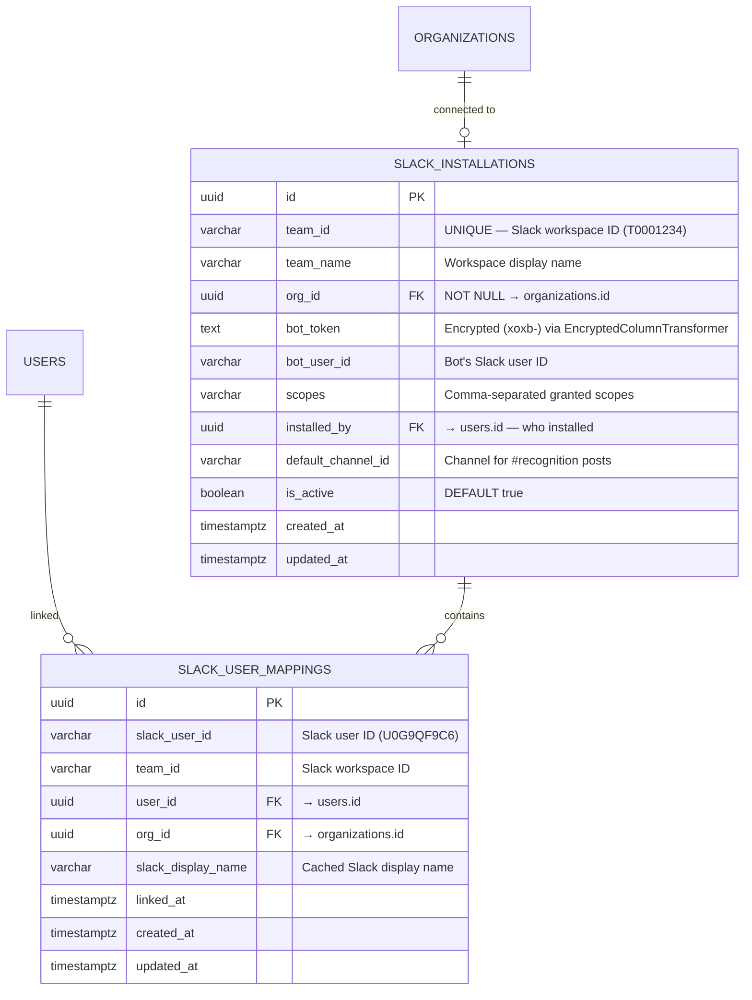

# Phase 6 — Slack Integration

## Overview

**Status**: 📋 Planning
**Goal**: Native Slack integration for "Good Job" — enabling employees to give kudos, view leaderboard, and browse rewards directly in Slack without switching to the web portal.
**Phase**: Phase 2 in Product Roadmap (Chat Integration)
**Business Impact**: Slack integration is a Pro-plan-only feature ($4/user/month) — key driver for upgrades from the Free tier.

**Core Principles:**
- **"Recognition in the flow of work"** — Zero context switching
- **Bi-directional sync** — Slack ↔ Portal always in sync
- **Reuse existing services** — Call `KudosService`, `RewardsService`, `PointsService` instead of duplicating logic
- **Security-first** — Request signature verification, encrypted tokens, CSRF protection

---

## 1. Overall Architecture

### 1.1 System Architecture

```
┌─────────────────────────────────────────────────────────────┐
│                    Slack Workspace                          │
│                                                             │
│  /kudos ──────→ Modal Form ──→ Submit ──→ #recognition post │
│  /leaderboard ──→ Ephemeral response (Block Kit table)      │
│  /rewards ────→ Ephemeral catalog + [Redeem] buttons        │
│  /mypoints ───→ Ephemeral balance summary                   │
│  Message Shortcut ──→ Modal (pre-filled recipient)          │
│  Emoji reaction ──→ Event → sync to portal                  │
│                                                             │
└──────────────────────┬──────────────────────────────────────┘
                       │ HTTPS (verified signature)
                       ▼
┌──────────────────────────────────────────────────────────────┐
│                  apps/api (NestJS)                           │
│                                                              │
│  ┌─────────────────────────────────────────────────────┐     │
│  │  modules/slack/                                     │     │
│  │   ├─ SlackController        (events, commands)      │     │
│  │   ├─ SlackOAuthController   (install/callback)      │     │
│  │   ├─ SlackService           (business logic)        │     │
│  │   ├─ SlackBlockBuilder      (Block Kit payloads)    │     │
│  │   ├─ SlackUserSyncService   (user mapping)          │     │
│  │   ├─ SlackInstallationService (CRUD installations)  │     │
│  │   └─ SlackEventListener     (Portal → Slack sync)   │     │
│  └─────────────────────┬───────────────────────────────┘     │
│                        │ reuses                              │
│  ┌─────────────────────▼───────────────────────────────┐     │
│  │  KudosService · RewardsService · PointsService      │     │
│  │  OrganizationsService · AdminService                 │     │
│  │  NotificationsService                                │     │
│  └──────────────────────────────────────────────────────┘     │
│                                                              │
│  ┌──────────────┐   ┌──────────────────┐                     │
│  │  BullMQ      │   │  Redis           │                     │
│  │  (async      │   │  (user cache,    │                     │
│  │   processing)│   │   event dedup,   │                     │
│  │              │   │   rate limiting)  │                     │
│  └──────────────┘   └──────────────────┘                     │
└──────────────────────────────────────────────────────────────┘
```

### 1.2 Data Flow — Give Kudos via Slack

```
1. User types /kudos in Slack
2. Slack POST → /slack/commands/kudos (< 3s timeout)
3. Server: ack() immediately, open modal via trigger_id
4. User fills modal: recipient, points, core value, message
5. User clicks "Give Kudos" → Slack POST → /slack/interactions
6. Server:
   a. Map Slack user_id → app user (via slack_user_mappings)
   b. Validate org plan (Pro only)
   c. Call KudosService.create() (same as web portal)
   d. Post Block Kit message → #recognition channel
   e. DM recipient: "You received 30 points!"
   f. Ephemeral to giver: "Sent! 170 pts remaining"
```

### 1.3 Data Flow — Portal → Slack (Bi-directional Sync)

```
1. User gives kudos on web portal
2. KudosService emits KUDOS_CREATED event (existing EventEmitter2)
3. SlackEventListener catches event
4. Lookup: slack_installations WHERE org_id = event.orgId
5. If found → post Block Kit message to default_channel_id
6. If receiver has Slack mapping → DM them too
```

---

## 2. Database Design

### 2.1 New Entity: `slack_installations`

Maps Slack workspace → Good Job organization (1:1 relationship).



### 2.2 Table: `slack_installations`

| Column | Type | Constraints | Description |
|--------|------|-------------|-------------|
| id | uuid | PK | Installation identifier |
| team_id | varchar | NOT NULL, UNIQUE | Slack workspace ID (e.g., `T0001234`) |
| team_name | varchar | NOT NULL | Workspace display name |
| org_id | uuid | NOT NULL, FK, INDEXED | → organizations.id |
| bot_token | text | NOT NULL | `xoxb-` token, encrypted at rest via `EncryptedColumnTransformer` |
| bot_user_id | varchar | NOT NULL | Bot's Slack user ID (e.g., `U0BOT123`) |
| scopes | varchar | NOT NULL | Comma-separated granted OAuth scopes |
| installed_by | uuid | NOT NULL, FK | → users.id (audit: who installed the app) |
| default_channel_id | varchar | NULLABLE | Channel ID for recognition announcements (e.g., `C01ABCDEF`) |
| is_active | boolean | DEFAULT true | Can be deactivated without deleting |
| created_at | timestamptz | NOT NULL | Installation timestamp |
| updated_at | timestamptz | NOT NULL | Last update |

**Business Rules:**
- One Slack workspace = one organization (UNIQUE on `team_id`)
- Bot token encrypted using existing `EncryptedColumnTransformer` in `apps/api/src/common/transformers/encrypted-column.transformer.ts`
- `default_channel_id` set during installation or via `/kudos-setup` admin command
- Deactivating (`is_active = false`) stops all Slack interactions for that workspace

### 2.3 Table: `slack_user_mappings`

| Column | Type | Constraints | Description |
|--------|------|-------------|-------------|
| id | uuid | PK | Mapping identifier |
| slack_user_id | varchar | NOT NULL | Slack user ID (e.g., `U0G9QF9C6`) |
| team_id | varchar | NOT NULL, INDEXED | Slack workspace ID — FK reference to `slack_installations.team_id` |
| user_id | uuid | NOT NULL, FK, INDEXED | → users.id |
| org_id | uuid | NOT NULL, FK | → organizations.id (denormalized for fast queries) |
| slack_display_name | varchar | NULLABLE | Cached Slack display name (updated on each interaction) |
| linked_at | timestamptz | NOT NULL | When mapping was created |
| created_at | timestamptz | NOT NULL | Record creation |
| updated_at | timestamptz | NOT NULL | Last update |

**Unique Constraint:** `(slack_user_id, team_id)` — One Slack user maps to one app user per workspace

**User Mapping Strategy:**
```
Slack command received (user_id + team_id)
     │
     ▼
SELECT * FROM slack_user_mappings
WHERE slack_user_id = ? AND team_id = ?
     │
     ├─ Found → proceed with mapped user_id
     │
     └─ Not found → auto-link attempt:
          │
          ▼
        Slack API: users.info(user_id) → get email
          │
          ▼
        SELECT * FROM users WHERE email = ?
          │
          ├─ Found → auto-create mapping, proceed
          │
          └─ Not found → ephemeral: "Sign up at good-job.xyz"
```

### 2.4 Migration

```sql
-- Migration: CreateSlackTables

CREATE TABLE slack_installations (
    id UUID PRIMARY KEY DEFAULT gen_random_uuid(),
    team_id VARCHAR NOT NULL UNIQUE,
    team_name VARCHAR NOT NULL,
    org_id UUID NOT NULL REFERENCES organizations(id),
    bot_token TEXT NOT NULL,
    bot_user_id VARCHAR NOT NULL,
    scopes VARCHAR NOT NULL,
    installed_by UUID NOT NULL REFERENCES users(id),
    default_channel_id VARCHAR,
    is_active BOOLEAN NOT NULL DEFAULT true,
    created_at TIMESTAMPTZ NOT NULL DEFAULT NOW(),
    updated_at TIMESTAMPTZ NOT NULL DEFAULT NOW()
);

CREATE INDEX idx_slack_installations_org_id ON slack_installations(org_id);

CREATE TABLE slack_user_mappings (
    id UUID PRIMARY KEY DEFAULT gen_random_uuid(),
    slack_user_id VARCHAR NOT NULL,
    team_id VARCHAR NOT NULL,
    user_id UUID NOT NULL REFERENCES users(id),
    org_id UUID NOT NULL REFERENCES organizations(id),
    slack_display_name VARCHAR,
    linked_at TIMESTAMPTZ NOT NULL DEFAULT NOW(),
    created_at TIMESTAMPTZ NOT NULL DEFAULT NOW(),
    updated_at TIMESTAMPTZ NOT NULL DEFAULT NOW(),
    UNIQUE(slack_user_id, team_id)
);

CREATE INDEX idx_slack_user_mappings_user_id ON slack_user_mappings(user_id);
CREATE INDEX idx_slack_user_mappings_team_id ON slack_user_mappings(team_id);
```

---

## 3. Slack App Configuration

### 3.1 App Manifest

```yaml
_metadata:
  major_version: 1
  minor_version: 1
display_information:
  name: Good Job
  description: Peer recognition & rewards for your team
  background_color: "#6366f1"
  long_description: |
    Good Job brings employee recognition into your Slack workspace.
    Give kudos with points, browse rewards, and celebrate wins — all without leaving Slack.
features:
  bot_user:
    display_name: Good Job
    always_online: true
  shortcuts:
    - name: Recognize this person
      type: message
      callback_id: recognize_message_shortcut
      description: Give kudos to the author of this message
  slash_commands:
    - command: /kudos
      url: https://api.good-job.xyz/slack/commands/kudos
      description: Give kudos to a teammate
      usage_hint: "[just type /kudos to open the form]"
      should_escape: false
    - command: /leaderboard
      url: https://api.good-job.xyz/slack/commands/leaderboard
      description: Show top recognized people this month
      should_escape: false
    - command: /rewards
      url: https://api.good-job.xyz/slack/commands/rewards
      description: Browse the rewards catalog
      should_escape: false
    - command: /mypoints
      url: https://api.good-job.xyz/slack/commands/mypoints
      description: Check your point balance
      should_escape: false
oauth_config:
  redirect_urls:
    - https://api.good-job.xyz/slack/oauth/callback
  scopes:
    bot:
      - commands
      - chat:write
      - chat:write.public
      - users:read
      - users:read.email
      - channels:read
      - im:write
      - reactions:read
      - app_mentions:read
settings:
  event_subscriptions:
    request_url: https://api.good-job.xyz/slack/events
    bot_events:
      - app_mention
      - reaction_added
      - app_home_opened
  interactivity:
    is_enabled: true
    request_url: https://api.good-job.xyz/slack/interactions
    message_menu_options_url: https://api.good-job.xyz/slack/options
  org_deploy_enabled: false
  socket_mode_enabled: false
```

### 3.2 Required Bot Token Scopes

| Scope | Purpose |
|-------|---------|
| `commands` | Register and receive slash commands |
| `chat:write` | Post messages in channels the bot is a member of |
| `chat:write.public` | Post to public channels without joining (for #recognition) |
| `users:read` | Look up user info by Slack user ID |
| `users:read.email` | Read user email (for auto-mapping to app users) |
| `channels:read` | List channels (for admin to select default recognition channel) |
| `im:write` | Send DMs to users (notifications, balance updates) |
| `reactions:read` | Receive `reaction_added` events (sync emoji reactions to portal) |
| `app_mentions:read` | Receive @mentions of the bot |

### 3.3 Environment Variables

```env
# Slack App Credentials
SLACK_CLIENT_ID=                  # From Slack App settings > Basic Information
SLACK_CLIENT_SECRET=              # From Slack App settings > Basic Information
SLACK_SIGNING_SECRET=             # For request signature verification
SLACK_STATE_SECRET=               # Random string for OAuth state CSRF protection
```

---

## 4. API Endpoints

### 4.1 OAuth Flow

| Method | Path | Auth | Description |
|--------|------|------|-------------|
| GET | `/slack/oauth/install` | JWT (admin/owner) | Redirect to Slack authorize URL |
| GET | `/slack/oauth/callback` | Public | OAuth callback — exchange code for bot token |
| DELETE | `/slack/oauth/uninstall` | JWT (admin/owner) | Disconnect Slack workspace |
| GET | `/slack/oauth/status` | JWT (admin/owner) | Check if current org has Slack connected |

**Install Flow:**

```
1. Admin clicks "Add to Slack" on web portal Settings page
2. GET /slack/oauth/install
   → Verify JWT: user must be admin/owner
   → Generate state = JWT({ orgId, userId }, SLACK_STATE_SECRET, 10min)
   → Redirect 302 → https://slack.com/oauth/v2/authorize
       ?client_id=SLACK_CLIENT_ID
       &scope=commands,chat:write,chat:write.public,users:read,users:read.email,...
       &redirect_uri=https://api.good-job.xyz/slack/oauth/callback
       &state={state_jwt}
3. User approves on Slack
4. GET /slack/oauth/callback?code=XXX&state=YYY
   → Verify state JWT (anti-CSRF)
   → POST https://slack.com/api/oauth.v2.access { code, client_id, client_secret }
   → Response: { access_token, team: { id, name }, bot_user_id, scope }
   → Upsert SlackInstallation { teamId, orgId, botToken (encrypted), ... }
   → Auto-create SlackUserMapping for installing user
   → Post welcome message to workspace
   → Redirect to web portal: /settings?slack=connected
```

### 4.2 Slack Webhook Endpoints

| Method | Path | Auth | Description |
|--------|------|------|-------------|
| POST | `/slack/commands/kudos` | Slack signature | Handle `/kudos` slash command |
| POST | `/slack/commands/leaderboard` | Slack signature | Handle `/leaderboard` command |
| POST | `/slack/commands/rewards` | Slack signature | Handle `/rewards` command |
| POST | `/slack/commands/mypoints` | Slack signature | Handle `/mypoints` command |
| POST | `/slack/events` | Slack signature | Handle event subscriptions (reactions, mentions) |
| POST | `/slack/interactions` | Slack signature | Handle interactive components (modal submissions, button clicks) |

**Important:** All Slack endpoints bypass JWT auth. Authentication is via `X-Slack-Signature` header verification.

### 4.3 Web Portal API Extensions

| Method | Path | Auth | Description |
|--------|------|------|-------------|
| GET | `/organizations/:id/slack` | JWT (admin/owner) | Get Slack integration status + settings |
| PATCH | `/organizations/:id/slack` | JWT (admin/owner) | Update settings (default channel, etc.) |
| POST | `/organizations/:id/slack/link` | JWT (any member) | Link current user's Slack account manually |

---

## 5. Module Structure

```
apps/api/src/modules/slack/
├── slack.module.ts
├── slack.controller.ts                # POST /slack/events, /slack/interactions
├── slack-commands.controller.ts       # POST /slack/commands/* (one handler per command)
├── slack-oauth.controller.ts          # GET /slack/oauth/install, /callback, DELETE /uninstall
├── slack.service.ts                   # Core business logic: process commands, map users, dispatch
├── slack-installation.service.ts      # CRUD for SlackInstallation entity
├── slack-user-sync.service.ts         # User mapping: Slack user ↔ app user, email matching
├── slack-block-builder.ts             # Pure functions: build Block Kit JSON payloads
├── slack-event-listener.service.ts    # @OnEvent() handlers: Portal events → Slack messages
├── slack-signature.guard.ts           # NestJS Guard: verify X-Slack-Signature
├── slack-raw-body.middleware.ts       # Middleware: preserve raw body for signature verification
├── dto/
│   ├── slack-command.dto.ts           # Slash command payload shape
│   ├── slack-event.dto.ts             # Event subscription payload shape
│   └── slack-interaction.dto.ts       # Interactive component payload shape
├── entities/
│   ├── slack-installation.entity.ts   # TypeORM entity
│   └── slack-user-mapping.entity.ts   # TypeORM entity
└── config/
    └── slack.config.ts                # registerAs('slack') config namespace
```

### 5.1 Dependencies

```bash
pnpm add @slack/web-api @slack/oauth
# Note: Using @slack/web-api directly instead of @slack/bolt
# for better NestJS integration (Bolt has its own HTTP server which conflicts)
```

**Why `@slack/web-api` instead of `@slack/bolt`:**
- Bolt wants to own the HTTP server (Express/Fastify receiver) — conflicts with NestJS
- `@slack/web-api` provides the Slack API client without opinionated server setup
- `@slack/oauth` handles OAuth token exchange
- Signature verification implemented as NestJS Guard (more idiomatic)

### 5.2 Module Registration

```typescript
// slack.module.ts
@Module({
  imports: [
    TypeOrmModule.forFeature([SlackInstallation, SlackUserMapping]),
    KudosModule,
    OrganizationsModule,
    RewardsModule,
    PointsModule,
    AdminModule,
    UsersModule,
  ],
  controllers: [
    SlackController,
    SlackCommandsController,
    SlackOAuthController,
  ],
  providers: [
    SlackService,
    SlackInstallationService,
    SlackUserSyncService,
    SlackEventListenerService,
    SlackBlockBuilder,
  ],
})
export class SlackModule {}
```

---

## 6. Slash Commands — Detailed UX Design

### 6.1 `/kudos` — Give Recognition

**Trigger:** User types `/kudos` in any channel

**Step 1 — Acknowledge + Open Modal (< 3 seconds)**

```typescript
// slack-commands.controller.ts
@Post('commands/kudos')
async handleKudos(@Body() command: SlackCommandDto) {
  // 1. Verify user is mapped
  const mapping = await this.userSync.findOrAutoLink(command.user_id, command.team_id);
  if (!mapping) return ephemeral('Link your account first: /goodjob connect');

  // 2. Verify org plan
  const installation = await this.installationService.findByTeamId(command.team_id);
  if (installation.organization.plan === 'free') {
    return ephemeral('Slack integration requires Pro plan. Upgrade at good-job.xyz/settings');
  }

  // 3. Fetch core values + org settings for modal
  const org = await this.orgService.findById(installation.orgId);
  const coreValues = org.coreValues.filter(v => v.isActive);

  // 4. Open modal via Slack API
  await this.slackApi.views.open({
    trigger_id: command.trigger_id,
    view: this.blockBuilder.buildKudosModal(coreValues, org.settings),
  });

  return ''; // empty 200 response (modal handles the rest)
}
```

**Step 2 — Modal Form**

```
┌──────────────────────────────────────┐
│  🏆 Give Kudos                       │
│                                      │
│  Who do you want to recognize?       │
│  ┌────────────────────────────────┐  │
│  │ 👤 Select a person          ▾ │  │  ← users_select (Slack native)
│  └────────────────────────────────┘  │
│                                      │
│  How many points?                    │
│  ┌────────────────────────────────┐  │
│  │ 30                             │  │  ← number_input (min: org.minPerKudo, max: org.maxPerKudo)
│  └────────────────────────────────┘  │
│                                      │
│  Core Value                          │
│  ┌────────────────────────────────┐  │
│  │ 🤝 Teamwork                ▾ │  │  ← static_select (populated from API)
│  │   🚀 Innovation              │  │
│  │   💡 Ownership               │  │
│  │   ❤️ Customer Focus           │  │
│  └────────────────────────────────┘  │
│                                      │
│  Message (min 10 characters)         │
│  ┌────────────────────────────────┐  │
│  │ Great work on the Q1 launch!  │  │  ← plain_text_input (min_length: 10)
│  │ Your attention to detail made │  │
│  │ a huge difference.            │  │
│  └────────────────────────────────┘  │
│                                      │
│  [Cancel]              [Give Kudos]  │
└──────────────────────────────────────┘
```

**Step 3 — Modal Submission → Process**

```typescript
// slack.controller.ts (interactions handler)
async handleViewSubmission(payload: SlackInteractionDto) {
  const { user, view } = payload;
  const values = view.state.values;

  // Extract form data
  const recipientSlackId = values.recipient_block.recipient.selected_user;
  const points = parseInt(values.points_block.points.value);
  const valueId = values.value_block.core_value.selected_option.value;
  const message = values.message_block.message.value;

  // Map Slack users → app users
  const giver = await this.userSync.getAppUser(user.id, payload.team.id);
  const receiver = await this.userSync.findOrAutoLink(recipientSlackId, payload.team.id);

  if (!receiver) {
    return ackWithErrors({ recipient_block: 'This person is not registered in Good Job' });
  }

  // Call existing KudosService (same as web portal)
  const kudos = await this.kudosService.create({
    giverId: giver.userId,
    receiverId: receiver.userId,
    orgId: giver.orgId,
    points,
    valueId,
    message,
  });

  // Post to #recognition channel
  const installation = await this.installationService.findByTeamId(payload.team.id);
  await this.slackApi.chat.postMessage({
    token: installation.botToken,
    channel: installation.defaultChannelId,
    blocks: this.blockBuilder.buildKudosAnnouncement(kudos, giver, receiver),
  });

  // DM recipient
  await this.slackService.dmUser(installation, recipientSlackId,
    this.blockBuilder.buildKudosReceivedDM(kudos, giver));

  // Ephemeral to giver (via response_action)
  // ... handled by Bolt/modal response
}
```

**Step 4 — #recognition Channel Post (Block Kit)**

```json
{
  "blocks": [
    {
      "type": "header",
      "text": { "type": "plain_text", "text": "🏆 Kudos!" }
    },
    {
      "type": "section",
      "text": {
        "type": "mrkdwn",
        "text": "<@U_GIVER> gave *30 points* to <@U_RECEIVER>\n\n> Great work on the Q1 launch! Your attention to detail made a huge difference."
      }
    },
    {
      "type": "context",
      "elements": [
        { "type": "mrkdwn", "text": "🤝 *Teamwork*" },
        { "type": "mrkdwn", "text": "30 pts" },
        { "type": "mrkdwn", "text": "<!date^1740200000^{date_short} at {time}|Feb 22, 2026>" }
      ]
    },
    {
      "type": "actions",
      "elements": [
        {
          "type": "button",
          "text": { "type": "plain_text", "text": "👏 High five!" },
          "action_id": "react_kudos",
          "value": "recognition_id"
        },
        {
          "type": "button",
          "text": { "type": "plain_text", "text": "View in Portal →" },
          "url": "https://good-job.xyz/dashboard",
          "action_id": "open_portal"
        }
      ]
    }
  ]
}
```

### 6.2 `/leaderboard` — View Top Contributors

```typescript
@Post('commands/leaderboard')
async handleLeaderboard(@Body() command: SlackCommandDto) {
  const installation = await this.installationService.findByTeamId(command.team_id);
  const analytics = await this.adminService.getAnalytics(installation.orgId, 30);

  return {
    response_type: 'ephemeral', // only visible to the user
    blocks: this.blockBuilder.buildLeaderboard(analytics.topReceivers, analytics.topGivers),
  };
}
```

**Block Kit Output:**

```
🏅 Leaderboard — Last 30 Days

Most Received:
🥇 Alice Johnson    — 450 pts (12 kudos)
🥈 Bob Smith        — 380 pts (9 kudos)
🥉 Charlie Brown    — 320 pts (8 kudos)
 4. Dave Wilson     — 280 pts (7 kudos)
 5. Eve Davis       — 250 pts (6 kudos)

────────────────────

[Most Given ▾]  [View full leaderboard →]
```

### 6.3 `/rewards` — Browse Catalog

```
🎁 Rewards Catalog
Your balance: 450 redeemable points

☕ Coffee Gift Card $25         300 pts  [Redeem]
👕 Company Hoodie               500 pts  ⚠️ Need 50 more pts
🎯 Friday Afternoon Off        1000 pts  ⚠️ Need 550 more pts
📚 Learning Budget $50          600 pts  ⚠️ Need 150 more pts

[View full catalog in portal →]
```

When user clicks [Redeem] → Confirm modal:

```
┌──────────────────────────────────┐
│  Confirm Redemption              │
│                                  │
│  ☕ Coffee Gift Card $25         │
│  Cost: 300 points                │
│  Your balance: 450 → 150 pts    │
│                                  │
│  [Cancel]         [Confirm]      │
└──────────────────────────────────┘
```

### 6.4 `/mypoints` — Check Balance

```
💰 Your Points — Good Job

📤 Giveable (Feb 2026):  170 / 200 remaining
    Expires: Feb 28, 2026

📥 Redeemable (Wallet):  450 pts
    Total earned: 1,250 pts | Total spent: 800 pts
```

---

## 7. Event Handling

### 7.1 Slack → Portal Events

| Event | Action |
|-------|--------|
| `reaction_added` on a kudos post | Create `RecognitionReaction` in DB (when API is implemented) |
| `app_mention` with "@Good Job kudos @user" | Open DM with guided kudos flow |
| `app_home_opened` | Render personalized App Home tab |

### 7.2 Portal → Slack Events (via EventEmitter2)

| Existing Event | Slack Action |
|----------------|-------------|
| `KUDOS_CREATED` | Post to #recognition channel + DM recipient |
| `REDEMPTION_STATUS_CHANGED` | DM user: "Your Coffee Gift Card was approved!" |
| `ORG_UPDATED` (future: budget reset) | DM all users: "Monthly budget reset! You have 200 points to give." |

```typescript
// slack-event-listener.service.ts
@Injectable()
export class SlackEventListenerService {
  constructor(
    private readonly installationService: SlackInstallationService,
    private readonly userSyncService: SlackUserSyncService,
    private readonly blockBuilder: SlackBlockBuilder,
  ) {}

  @OnEvent(CacheEvents.KUDOS_CREATED)
  async handleKudosCreated(event: KudosCreatedEvent) {
    const installation = await this.installationService.findByOrgId(event.orgId);
    if (!installation?.isActive) return;

    // Post to #recognition channel
    const client = new WebClient(installation.botToken);
    await client.chat.postMessage({
      channel: installation.defaultChannelId,
      blocks: this.blockBuilder.buildKudosAnnouncement(event),
    });

    // DM recipient if they have Slack mapping
    const receiverMapping = await this.userSyncService.findByAppUserId(
      event.receiverId, installation.teamId
    );
    if (receiverMapping) {
      const dm = await client.conversations.open({ users: receiverMapping.slackUserId });
      await client.chat.postMessage({
        channel: dm.channel.id,
        blocks: this.blockBuilder.buildKudosReceivedDM(event),
      });
    }
  }

  @OnEvent(CacheEvents.REDEMPTION_STATUS_CHANGED)
  async handleRedemptionStatus(event: RedemptionStatusEvent) {
    // Similar: DM the user about their redemption status change
  }
}
```

### 7.3 Event Deduplication

Slack may retry events. Use Redis to deduplicate:

```typescript
// slack.controller.ts
@Post('events')
async handleEvent(@Body() body: any, @Headers() headers: Record<string, string>) {
  // URL verification challenge
  if (body.type === 'url_verification') {
    return { challenge: body.challenge };
  }

  // Deduplicate retries
  const eventId = headers['x-slack-event-id'];
  const retryNum = headers['x-slack-retry-num'];
  if (retryNum) {
    const processed = await this.redis.get(`slack:event:${eventId}`);
    if (processed) return { ok: true }; // already handled
  }

  // Mark as processing
  await this.redis.set(`slack:event:${eventId}`, '1', 'EX', 3600);

  // Process asynchronously (don't block the 3s window)
  this.slackService.processEvent(body.event).catch(err => {
    this.logger.error('Failed to process Slack event', err);
  });

  return { ok: true };
}
```

---

## 8. Security

### 8.1 Request Signature Verification (NestJS Guard)

```typescript
// slack-signature.guard.ts
@Injectable()
export class SlackSignatureGuard implements CanActivate {
  constructor(private readonly configService: ConfigService) {}

  canActivate(context: ExecutionContext): boolean {
    const request = context.switchToHttp().getRequest();
    const signingSecret = this.configService.get('slack.signingSecret');

    const timestamp = request.headers['x-slack-request-timestamp'];
    const signature = request.headers['x-slack-signature'];
    const rawBody = request.rawBody; // from SlackRawBodyMiddleware

    // Reject if timestamp > 5 minutes old (replay attack protection)
    const now = Math.floor(Date.now() / 1000);
    if (Math.abs(now - parseInt(timestamp)) > 300) {
      throw new UnauthorizedException('Request too old');
    }

    // Compute expected signature
    const baseString = `v0:${timestamp}:${rawBody}`;
    const computedSig = 'v0=' + crypto
      .createHmac('sha256', signingSecret)
      .update(baseString)
      .digest('hex');

    // Constant-time comparison (prevents timing attacks)
    if (!crypto.timingSafeEqual(Buffer.from(computedSig), Buffer.from(signature))) {
      throw new UnauthorizedException('Invalid Slack signature');
    }

    return true;
  }
}
```

### 8.2 Raw Body Middleware

NestJS parses JSON by default, destroying the raw body needed for signature verification:

```typescript
// slack-raw-body.middleware.ts
@Injectable()
export class SlackRawBodyMiddleware implements NestMiddleware {
  use(req: Request, res: Response, next: NextFunction) {
    if (req.headers['content-type'] === 'application/x-www-form-urlencoded' ||
        req.headers['content-type'] === 'application/json') {
      const chunks: Buffer[] = [];
      req.on('data', (chunk) => chunks.push(chunk));
      req.on('end', () => {
        req['rawBody'] = Buffer.concat(chunks).toString();
        next();
      });
    } else {
      next();
    }
  }
}
```

**Registration:** Apply only to `/slack/*` routes in `SlackModule`:

```typescript
export class SlackModule implements NestModule {
  configure(consumer: MiddlewareConsumer) {
    consumer.apply(SlackRawBodyMiddleware).forRoutes('/slack/*');
  }
}
```

### 8.3 OAuth State CSRF Protection

```typescript
// Generate state (anti-CSRF)
const state = this.jwtService.sign(
  { orgId, userId, purpose: 'slack_oauth' },
  { secret: SLACK_STATE_SECRET, expiresIn: '10m' }
);

// Verify state on callback
const decoded = this.jwtService.verify(state, { secret: SLACK_STATE_SECRET });
if (decoded.purpose !== 'slack_oauth') throw new UnauthorizedException();
```

### 8.4 Token Security

| Concern | Implementation |
|---------|---------------|
| Bot token at rest | `EncryptedColumnTransformer` (AES-256-GCM, existing pattern) |
| Token in logs | Never log bot_token — add to log sanitization |
| Token in responses | Never return bot_token in any API response |
| Token rotation | If Slack reissues token on re-install, update existing record |
| Workspace uninstall | Set `is_active = false`, keep token for audit trail |

---

## 9. Plan Gating (Pro Tier)

Slack integration is only available for **Pro Trial** and **Pro** plans:

```typescript
// In SlackService or SlackGuard
async validateOrgPlan(teamId: string): Promise<boolean> {
  const installation = await this.installationService.findByTeamId(teamId);
  const org = installation.organization;

  if (org.plan === OrgPlan.FREE) {
    return false; // Block with upgrade message
  }

  if (org.plan === OrgPlan.PRO_TRIAL && org.trialEndsAt < new Date()) {
    return false; // Trial expired
  }

  return true;
}
```

**User experience when blocked:**

```
⚠️ Slack integration requires a Pro plan.

Your organization is on the Free plan.
Upgrade at https://good-job.xyz/settings/billing

Pro plan includes:
• Unlimited Slack commands
• Recognition in the flow of work
• Weekly digest DMs
• And more...

Starting at $4/user/month
```

---

## 10. Web Portal UI Changes

### 10.1 Settings Page — Slack Section

Add an "Integrations" tab in `/settings` or a section in Admin settings:

```
┌──────────────────────────────────────────────────────────┐
│  ⚡ Integrations                                         │
│                                                          │
│  ┌────────────────────────────────────────────────────┐  │
│  │  Slack                                   [Connected]│  │
│  │                                                    │  │
│  │  Workspace: Amanotes                               │  │
│  │  Recognition Channel: #recognition                 │  │
│  │  [Change Channel ▾]                                │  │
│  │                                                    │  │
│  │  Linked Users: 24 / 30                             │  │
│  │                                                    │  │
│  │  [Disconnect Slack]                                │  │
│  └────────────────────────────────────────────────────┘  │
│                                                          │
│  ┌────────────────────────────────────────────────────┐  │
│  │  Telegram                           [Coming Soon]  │  │
│  └────────────────────────────────────────────────────┘  │
└──────────────────────────────────────────────────────────┘
```

### 10.2 Onboarding Step (Optional)

Add an optional step in the onboarding flow or a post-onboarding prompt:

```
🎉 Your workspace is ready!

Want to supercharge recognition?
Connect Slack so your team can give kudos without leaving chat.

[Add to Slack]    [Maybe later]
```

---

## 11. Rate Limiting & Performance

### 11.1 Slack API Rate Limits

| API Method | Tier | Limit | Our Strategy |
|------------|------|-------|-------------|
| `chat.postMessage` | Tier 3 | ~50/min/workspace | Queue messages, batch if needed |
| `users.info` | Tier 4 | ~100/min | Cache in Redis (TTL: 1 hour) |
| `views.open` | Tier 4 | ~100/min | Direct call (low volume) |
| `conversations.open` | Tier 3 | ~50/min | Cache DM channel IDs |

### 11.2 Our API Rate Limits

Slack endpoints need separate rate limiting (not using the existing JWT-based rate limit):

```typescript
// Per-workspace rate limiting via Redis
const key = `slack:ratelimit:${teamId}:${command}`;
const count = await this.redis.incr(key);
if (count === 1) await this.redis.expire(key, 60);
if (count > 30) return ephemeral('Too many requests. Please wait a moment.');
```

### 11.3 Caching Strategy

| Data | Cache Key | TTL | Invalidation |
|------|-----------|-----|-------------|
| Slack user info (email) | `slack:user:{slackUserId}` | 1 hour | On user profile update event |
| User mapping | `slack:mapping:{slackUserId}:{teamId}` | 24 hours | On explicit re-link |
| DM channel ID | `slack:dm:{slackUserId}` | 24 hours | Never (stable) |
| Installation | `slack:install:{teamId}` | 1 hour | On install/uninstall |
| Core values (for modal) | `slack:values:{orgId}` | 5 min | On ORG_UPDATED event |

---

## 12. Async Processing (BullMQ)

Slack's 3-second response timeout means heavy work must be async:

```
Sync (< 3s):                    Async (BullMQ queue):
├─ Verify signature              ├─ Call KudosService.create()
├─ Lookup user mapping           ├─ Post to #recognition channel
├─ Validate org plan             ├─ DM recipient
├─ Open modal / ack              ├─ Create notifications
└─ Return 200                    ├─ Update analytics cache
                                 └─ Sync reactions to portal
```

```typescript
// Queue definition
@Processor('slack')
export class SlackProcessor {
  @Process('post-kudos-announcement')
  async handleKudosAnnouncement(job: Job<KudosAnnouncementData>) {
    const { teamId, recognitionId } = job.data;
    // ... post Block Kit message
  }

  @Process('dm-user')
  async handleDmUser(job: Job<DmUserData>) {
    const { teamId, slackUserId, blocks } = job.data;
    // ... send DM
  }
}
```

---

## 13. Testing Strategy

### 13.1 Unit Tests

| File | Tests |
|------|-------|
| `slack-block-builder.spec.ts` | Block Kit payload generation (pure functions, easy to test) |
| `slack-user-sync.service.spec.ts` | User mapping logic, email matching, edge cases |
| `slack-signature.guard.spec.ts` | Signature verification, replay attack prevention |
| `slack.service.spec.ts` | Command processing, plan gating, error handling |

### 13.2 Integration Tests

| File | Tests |
|------|-------|
| `slack-oauth.e2e-spec.ts` | OAuth install flow, callback handling, state CSRF |
| `slack-commands.e2e-spec.ts` | Slash command processing end-to-end |
| `slack-events.e2e-spec.ts` | Event handling, deduplication |

### 13.3 E2E Tests (apps/e2e)

| File | Tests |
|------|-------|
| `slack-settings.spec.ts` | Web portal: Connect/disconnect Slack, channel selection |

---

## 14. Implementation Phases

### Phase 2a — Core Slack Integration (MVP)

**Goal:** Users can give kudos and check balance from Slack

| Step | Task | Estimate |
|------|------|----------|
| 1 | Database: Create entities + migration | S |
| 2 | Config: Add slack.config.ts + env validation | S |
| 3 | Security: SlackSignatureGuard + RawBodyMiddleware | M |
| 4 | OAuth: Install/callback/uninstall flow | M |
| 5 | User mapping: SlackUserSyncService (email matching) | M |
| 6 | `/kudos` command: Modal + submission → KudosService | L |
| 7 | `/mypoints` command: Balance check | S |
| 8 | Block Kit builder: Kudos announcement, balance display | M |
| 9 | Portal → Slack sync: KUDOS_CREATED event listener | M |
| 10 | Web portal: Settings page Slack section | M |
| 11 | Unit + integration tests | L |

### Phase 2b — Extended Commands

| Step | Task | Estimate |
|------|------|----------|
| 12 | `/leaderboard` command | M |
| 13 | `/rewards` command + redemption flow | L |
| 14 | Redemption status DM notifications | S |
| 15 | Message shortcut: "Recognize this person" | M |

### Phase 2c — Advanced Features

| Step | Task | Estimate |
|------|------|----------|
| 16 | App Home tab (personal dashboard) | L |
| 17 | Weekly digest DM (scheduled job) | M |
| 18 | `reaction_added` event → sync to portal | M |
| 19 | Budget expiry reminders | S |
| 20 | Channel analytics command | M |

---

## 15. Infrastructure Changes

### 15.1 Kubernetes (Pulumi — apps/infra)

Add Slack secrets to the existing GKE deployment:

```typescript
// apps/infra/index.ts — add to existing secrets
const slackSecrets = new k8s.core.v1.Secret('slack-secrets', {
  metadata: { name: 'slack-secrets', namespace: ns.metadata.name },
  stringData: {
    SLACK_CLIENT_ID: config.require('slackClientId'),
    SLACK_CLIENT_SECRET: config.requireSecret('slackClientSecret'),
    SLACK_SIGNING_SECRET: config.requireSecret('slackSigningSecret'),
    SLACK_STATE_SECRET: config.requireSecret('slackStateSecret'),
  },
});
```

### 15.2 DNS / Networking

- Slack webhooks require a public HTTPS endpoint
- Existing `api.good-job.xyz` already has SSL — just add routes
- No separate subdomain needed

### 15.3 GitHub Actions

Add Slack secrets to the CI/CD pipeline (`.github/workflows/deploy-apps.yml`).

---

## 16. Risks & Mitigations

| Risk | Impact | Mitigation |
|------|--------|------------|
| Slack API rate limits | Kudos announcements delayed | BullMQ queue with exponential backoff |
| User email mismatch (Slack vs portal) | Can't auto-link users | Fallback: manual `/goodjob connect` flow |
| 3-second response timeout | Command appears to fail | Acknowledge immediately, process async |
| Bot token compromise | Full workspace access | Encrypted at rest, never logged, audit trail |
| Slack deprecates API | Breaking changes | Pin SDK versions, monitor changelog |
| High volume workspace (1000+ users) | Performance degradation | Cache aggressively, batch notifications |
| Free tier users try commands | Confusing UX | Clear upgrade message with portal link |

---

## 17. Success Metrics

| Metric | Target | Measurement |
|--------|--------|-------------|
| Slack adoption rate | 60% of Pro orgs install within 30 days | `COUNT(slack_installations) / COUNT(orgs WHERE plan = 'pro')` |
| Slack-originated kudos | 40% of total kudos via Slack | `recognitions WHERE source = 'slack' / total` |
| User linking rate | 80% of org members linked | `COUNT(slack_user_mappings) / COUNT(org_memberships)` |
| Command response time | P95 < 2 seconds | Slack acknowledgment latency |
| Pro conversion from trial | +15% increase after Slack feature | A/B test trial cohorts |

---

## Appendix A — Slack Block Kit Reference

### A.1 Modal View Structure

```json
{
  "type": "modal",
  "callback_id": "kudos_submit",
  "title": { "type": "plain_text", "text": "Give Kudos" },
  "submit": { "type": "plain_text", "text": "Give Kudos" },
  "close": { "type": "plain_text", "text": "Cancel" },
  "blocks": [
    {
      "type": "input",
      "block_id": "recipient_block",
      "label": { "type": "plain_text", "text": "Who do you want to recognize?" },
      "element": {
        "type": "users_select",
        "action_id": "recipient",
        "placeholder": { "type": "plain_text", "text": "Select a person" }
      }
    },
    {
      "type": "input",
      "block_id": "points_block",
      "label": { "type": "plain_text", "text": "Points" },
      "element": {
        "type": "number_input",
        "action_id": "points",
        "is_decimal_allowed": false,
        "min_value": "10",
        "max_value": "50",
        "initial_value": "30",
        "placeholder": { "type": "plain_text", "text": "10-50" }
      }
    },
    {
      "type": "input",
      "block_id": "value_block",
      "label": { "type": "plain_text", "text": "Core Value" },
      "element": {
        "type": "static_select",
        "action_id": "core_value",
        "options": []
      }
    },
    {
      "type": "input",
      "block_id": "message_block",
      "label": { "type": "plain_text", "text": "Message" },
      "element": {
        "type": "plain_text_input",
        "action_id": "message",
        "multiline": true,
        "min_length": 10,
        "placeholder": { "type": "plain_text", "text": "Why are you recognizing them? (min 10 characters)" }
      }
    }
  ]
}
```

### A.2 Ephemeral Response

```json
{
  "response_type": "ephemeral",
  "text": "Kudos sent! You gave 30 points to @alice. You have 170 points remaining this month."
}
```
